مصرف ليبيا المركزي

إدارة البحوث والإحصاء

تطور أهم البيانات والمؤشرات
المالية للمصارف التجارية
( الربع الثالث 2020)

[An image of colorful 3D charts and graphs, including bar charts, a pie chart, and an upward trending arrow, all sitting on top of a grid or spreadsheet background.]

1
---
# ملخص تطور أهم البيانات المالية للمصارف التجارية
## (الربع الثالث 2020)

شهدت البيانات المالية للمصارف التجارية نهاية الربع الثالث 2020 بعض التغيرات مقارنة عما كانت
عليه في نهاية الربع الثالث من عام 2019 وذلك على النحو التالي :

- ارتفع إجمالي أصول المصارف التجارية (باستثناء الحسابات النظامية) من 117.6 مليار دينار في
نهاية الربع الثالث 2019 إلى نحو 124.8 مليار دينار في نهاية الربع الثالث 2020، أي بمعدل
نمو قدره 6.1%، وقـــد شكلت الأصـــــول الســـــائلة (البالغة نحو 89.1 مليار دينار) من إجمالي
الأصول ما نسبته 71.4%، مقارنة بما نسبته 70.7% عن ما كانت عليه في نهاية الربع الثالث 2019.

| إجمالي الأصول داخل الميزانية للمصارف التجارية |
| (2012 - الربع الثالث 2020) |
|:---:|
| Chart showing total assets of commercial banks from 2012 to Q3 2020 |

| السنة | القيمة (مليار دينار) |
|:---:|:---:|
| 2012 | 84.4 |
| 2013 | 98.4 |
| 2014 | 95.2 |
| 2015 | 90.2 |
| 2016 | 103.5 |
| 2017 | 116.5 |
| 2018 | 117.2 |
| 2019 | 111.8 |
| الربع الثالث 2020 | 124.8 |

- ارتفع إجمالي ودائع المصارف التجارية ( تحت الطلب وشهادات الإيداع ) لدى المصرف المركزي
بما فيها الاحتياطي الإلزامي من نحو 72.2 مليار دينار في نهاية الربع الثالث 2019 إلى نحو 82.6
مليار دينار في نهاية الربع الثالث 2020، أي بمعدل بلغ 14.4% ، والتي يشكل منها الاحتياطي الإلزامي
نحو 20.0 مليار دينار.

- ارتفع اجمالي رصيد الائتمان الممنوح من المصارف التجارية من 16.7 مليار دينار في نهاية الربع
الثالث 2019 إلى 16.8 مليار دينار في نهاية الربع الثالث 2020، أي بمعدل نمو 0.4%، وقد شكلت
القروض والتسهيلات الائتمانية الممنوحة إلى إجمالي الخصوم الإيداعية ما نسبته 16.8%، كما شكلت
من إجمالي الأصول ما نسبته 13.4% ، وبلغ رصيد القروض الممنوحة للقطاع الخاص في نهاية الربع
الثالث 2020 ما قيمته 10.6 مليار دينار، وما نسبته 63.4% من إجمالي القروض والتسهيلات الائتمانية
---
الممنوحة، فيما شكل رصيد القروض الممنوحة للقطاع العام النسبة الباقية 36.6% والتي بلغت قيمتها 6.1 مليار دينار.

## إجمالي رصيد القروض الممنوحة من المصارف التجارية
### (2012 - الربع الثالث 2020)

| السنة | القيمة (مليار دينار) |
|-------|---------------------|
| 2012  | 15.9                |
| 2013  | 18.2                |
| 2014  | 20.0                |
| 2015  | 20.2                |
| 2016  | 18.8                |
| 2017  | 17.5                |
| 2018  | 16.4                |
| 2019  | 16.9                |
| الربع الثالث 2020 | 16.8    |

- بلغـــت نسبة تغطيـــة مخصـــص الديون المشـــكوك فيها لإجمـــالي الائتمان الممنـــوح نسبة 21.4% في نهاية الربع الثالث 2020 مقابل نسبة 20.7% في نهاية الربع الثالث 2019.

- ارتفعت ودائع العمـــلاء لـــدى المصارف التجارية من 91.4 مليار دينـــار في نهاية الربع الثالث 2019، إلى 99.9 مليار دينار في نهاية الربع الثالث 2020، أي بمعدل 9.3%، وقد شكلت الودائع تحت الطلب ما نسبته 87.8% من إجمالي الودائع، في حين شكلت الودائع لأجل نسبة 11.8% من إجمالي الودائع، بينما شكلت ودائع الادخار ما نسبته 0.4% فقط من إجمالي الودائع.

وفيما يتعلق بتوزيع هذه الودائع فقد بلغت ودائع القطاع الخاص في نهاية الربع الثالث 2020 ما قيمته 56.1 مليار دينار، وما نسبته 56.0% من إجمالي الودائع، فيما شكل رصيد ودائع القطاع العام والحكومي النسبة الباقية وقدرها 44.0% أي ما قيمته 43.9 مليار دينار، منها 30.6 مليار دينار ودائع لشركات ومؤسسات القطاع العام ونحو 13.3 مليار دينار ودائع حكومية.

## إجمالي ودائع العملاء لدى المصارف التجارية
### (2012 - الربع الثالث 2020)

| السنة | ودائع تحت الطلب | ودائع زمنية | ودائع إدخارية | إجمالي الودائع |
|-------|-----------------|-------------|----------------|-----------------|
| 2012  | 68.3            |             |                | 68.3            |
| 2013  | 83.6            |             |                | 83.6            |
| 2014  | 79.1            |             |                | 79.1            |
| 2015  | 71.3            |             |                | 71.3            |
| 2016  | 83.4            |             |                | 83.4            |
| 2017  | 95.9            |             |                | 95.9            |
| 2018  | 93.7            |             |                | 93.7            |
| 2019  | 88.6            |             |                | 88.6            |
| الربع الثالث 2020 | 99.9 |             |                | 99.9            |
---
- ارتفع إجمالي حقوق الملكية في المصــارف التجارية من 6.4 مليار دينار في نهاية الربع الثالث 2019 إلى 6.6 مليار دينار في نهاية الربع الثالث 2020، وبمعدل 1.8%.

- تراجعت أرباح المصارف التجارية (قبل خصم المخصصات والضرائب) خلال التسعة أشهر الأولى من عام 2020 بمعدل 39.7% لتصل إلى 405.7 مليون دينار، مقارنة عما كانت عليه خلال نفس الفترة من عام 2019 والبالغة نحو 672.8 مليون دينار.

## أرباح الفترة قبل خصم المخصصات والضرائب

| الربع الثالث 2019 | الربع الثالث 2020 |
|-------------------|-------------------|
| 672.8             | 405.7             |

*القيم بالمليون دينار*

## أرباح المصارف التجارية قبل خصم المخصصات والضرائب خلال الفترة (2012 - 2019)

| السنة | القيمة |
|-------|--------|
| 2012  | 527.1  |
| 2013  | 451.1  |
| 2014  | 265.4  |
| 2015  | 213.0  |
| 2016  | 247.1  |
| 2017  | 464.6  |
| 2018  | 1222.2 |
| 2019  | 867.7  |

*القيم بالمليون دينار*
---
# تفرع المصارف التجارية :-

بلغ عدد المصارف المشتملة بياناتها في هذا التقرير 18 مصرفاً (بما في ذلك وحدة الدينار الليبي التابعة للمصرف الليبي الخارجي) حتى نهاية الربع الثالث 2020، وتزاول هذه المصارف نشاطها من خلال 550 فرعاً ووكالة مصرفية مقارنة بنحو 535 فرعاً ووكالة مصرفية في نهاية الربع الثالث 2019، والزيادة في عدد الفروع والوكالات المصرفية تركزت في (المصرف التجاري الوطني والمصرف الليبي الإسلامي).

## تطور عدد الفروع والوكالات المصرفية والعاملين بها

| السنة | عدد الفروع والوكالات | عدد العاملين بالقطاع المصرفي |
|-------|----------------------|---------------------------|
| 2012  | 498                  | 17,575                    |
| 2013  | 515                  | 18,878                    |
| 2014  | 516                  | 19,183                    |
| 2015  | 516                  | 19,214                    |
| 2016  | 521                  | 19,255                    |
| 2017  | 522                  | 19,324                    |
| 2018  | 527                  | 19,263                    |
| 2019  | 543                  | 19,387                    |
| الربع الثالث 2020 | 550      | 19,565                    |

## عدد الفروع والوكالات المصرفية (2012 - الربع الثالث 2020)

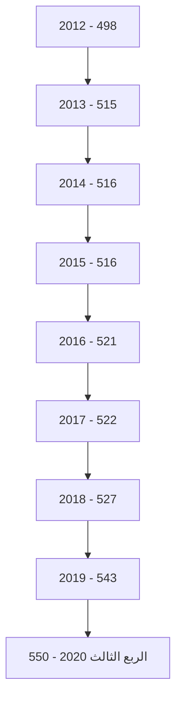
---
# الكثافة المصرفية

بالألف نسمة

| السنة | لكل مصرف | لكل فرع ووكالة |
|-------|-----------|-----------------|
| 2012  | 389.0     | 12.1            |
| 2013  | 397.0     | 12.2            |
| 2014  | 397.0     | 12.2            |
| 2015  | 393.8     | 12.2            |
| 2016  | 382.4     | 12.5            |
| 2017  | 394.1     | 12.8            |
| 2018  | 383.3     | 13.1            |
| 2019  | 368.4     | 12.9            |
| الربع الثالث 2020 | 368.4     | 12.9            |

## التركز المصرفي:

درجة التركز المصرفي تعني أن عدداً قليلاً من المصارف التجارية يستأثر بالنسبة الأكبر من النشاط المصرفي سواءً من حيث الأصول أو الودائع أو الائتمان أو من حيث حجم حقوق الملكية، وفيما يخص الحصة السوقية للمصارف التجارية في ليبيا، فقد شكلت أصول المصارف الأربعة الكبرى (الجمهورية، التجاري الوطني ، الوحدة والصحاري) من أصل 18 مصرفاً مانسبته 73.0% من إجمالي أصول القطاع المصرفي في نهاية الربع الثالث 2020، وشكل مصرف الجمهورية وحده ما نسبته 30.7% من إجمالي أصول القطاع المصرفي.

وشكلت ودائع وقروض المصارف الأربعة الكبرى مانسبته 72.9 % و 87.6 % على التوالي من إجمالي ودائع وقروض القطاع المصرفي في نهاية الربع الثالث 2020 .

وهذه النسب المرتفعة توضح أن السوق المصرفي الليبي يعاني من تركز مرتفع يحول دون تحقيق المنافسة العادلة بين المصارف المتواجدة به ، وذلك بسبب إستحواذ أحد المصارف أو عدد قليل جداً منها بحصة كبيرة في السوق، في حين أن حصة معظم المصارف الأخرى متدنية للغاية.

إن التركز المصرفي يؤثر على المنافسة في سلوك المصارف وأدائها بطرق غير ملائمة، وينتج عنها خسارة اجتماعية مقترنة بسوء التسعير، ناتجة عن ممارسات المصارف لقوتها السوقية على الأسعار، الأمر الذي يُخشى معه أنه كلما إرتفعت درجة الإحتكار في السوق كلما إرتفعت معها أسعار الخدمات المصرفية وتدني مستوى أو جودة الخدمة.
---
ونتيجة لهذا تزداد الحاجة إلى وضع القوانين والتشريعات التي تساهم في تعزيز ورفع مستويات
المنافسة فيما بين المصارف وكذلك الإصلاح المالي، وإنشاء المزيد من المصارف لرفع مستويات
المنافسة والكفاءة، ودخول مصارف جديدة سيزيد من المنافسة ويخفض مستويات التركز المصرفي.

## التركز المصرفي
### ( 2012 - الربع الثالث 2020 )

#### حسب الأصول:

| "نسب مئوية" الربع الثالث 2020 | 2019 | 2018 | 2017 | 2016 | 2015 | 2014 | 2013 | 2012 | المصارف |
|---------------------------|------|------|------|------|------|------|------|------|---------|
| 30.7 | 31.9 | 32.7 | 33.6 | 33.8 | 34.9 | 33.1 | 33.0 | 37.9 | أكبر مصرف |
| 62.6 | 64.6 | 65.8 | 66.9 | 67.9 | 67.6 | 62.1 | 63.7 | 71.0 | أكبر ثلاثة مصارف |
| 84.0 | 84.2 | 84.3 | 85.0 | 86.7 | 87.1 | 79.2 | 81.3 | 89.0 | أكبر خمسة مصارف |

#### حسب الإئتمان:

| "نسب مئوية" الربع الثالث 2020 | 2019 | 2018 | 2017 | 2016 | 2015 | 2014 | 2013 | 2012 | المصارف |
|---------------------------|------|------|------|------|------|------|------|------|---------|
| 42.4 | 40.7 | 43.6 | 44.5 | 44.3 | 44.8 | 43.5 | 44.8 | 41.9 | أكبر مصرف |
| 77.4 | 75.8 | 77.7 | 77.7 | 78.5 | 79.4 | 79.1 | 76.7 | 77.0 | أكبر ثلاثة مصارف |
| 91.1 | 91.4 | 91.5 | 91.2 | 91.3 | 91.4 | 91.1 | 90.2 | 91.0 | أكبر خمسة مصارف |

#### حسب ودائع العملاء:

| "نسب مئوية" الربع الثالث 2020 | 2019 | 2018 | 2017 | 2016 | 2015 | 2014 | 2013 | 2012 | المصارف |
|---------------------------|------|------|------|------|------|------|------|------|---------|
| 31.4 | 32.3 | 31.9 | 33.6 | 34.0 | 34.8 | 33.1 | 33.8 | 40.9 | أكبر مصرف |
| 62.5 | 64.4 | 65.2 | 66.5 | 67.2 | 66.5 | 61.3 | 62.7 | 71.5 | أكبر ثلاثة مصارف |
| 85.2 | 85.6 | 85.4 | 85.7 | 87.5 | 87.8 | 78.6 | 80.9 | 90.1 | أكبر خمسة مصارف |
---

## تركز الأصول

| Bank | Percentage |
|------|------------|
| مصرف الجمهورية | 31% |
| المصرف التجاري الوطني | 17% |
| مصرف الوحدة | 15% |
| مصرف الصحاري | 11% |
| باقي المصارف | 26% |

## تركز الائتمان

| Bank | Percentage |
|------|------------|
| مصرف الجمهورية | 42% |
| المصرف التجاري الوطني | 19% |
| مصرف الوحدة | 16% |
| مصرف الصحاري | 10% |
| باقي المصارف | 13% |

## تركز ودائع العملاء

| Bank | Percentage |
|------|------------|
| مصرف الجمهورية | 32% |
| المصرف التجاري الوطني | 17% |
| مصرف الوحدة | 14% |
| مصرف الصحاري | 11% |
| باقي المصارف | 26% |

8
---
# الميزانية المُجمَّعة للمصارف التجارية

شهدت الميزانية المُجمَّعة للمصارف التجارية نهاية الربع الثالث 2020، تطورات في مُجمل بنودها
على جانبي الأصول والخصوم ليبلغ إجمالي الأصول داخل الميزانية المُجمَّعة نحو 124,802.7 مليون
دينار، مقابل 117,605.2 مليون دينار في نهاية الربع الثالث 2019، بارتفاع قدره 7,197.2 مليون
دينار، أي بمعدل 6.1%، وفيما يلي جدول يلخص البنود الرئيسية للميزانية المُجمَّعة للمصارف التجارية:

## البنود الرئيسية للميزانية المُجمَّعة للمصارف التجارية

| مليون دينار |  |  |  |  |  |
|---|---|---|---|---|---|
| معدل التغير % | مقدار التغير | الربع الثالث 2020 | الربع الثالث 2019 | جانب الأصول : |  |
| -43.2 | -1,241.7 | 1,632.5 | 2,874.2 | نقدية بالخزائن |  |
| -30.3 | -2,495.9 | 5,744.7 | 8,240.6 | حسابات المقاصة |  |
| 9.0 | 7,211.1 | 87,522.6 | 80,311.5 | أرصدة لدى المصارف |  |
| 282.1 | 3,142.6 | 4,256.7 | 1,114.1 | الإستثمارات |  |
| 0.4 | 71.7 | 16,761.2 | 16,689.5 | القروض والتسهيلات |  |
| 11.1 | 188.8 | 1,895.4 | 1,706.6 | الأصول الثابتة |  |
| 4.8 | 320.8 | 6,989.6 | 6,668.8 | الأصول الأخرى |  |
| 6.1 | 7,197.5 | 124,802.7 | 117,605.2 | إجمالي الأصول |  |
| -20.1 | -8,604.7 | 34,239.4 | 42,844.1 | الحسابات النظامية |  |
| -0.9 | -1,407.2 | 159,042.1 | 160,449.3 | إجمالي الميزانية |  |
|  |  |  |  |  |  |
| معدل التغير % | مقدار التغير | الربع الثالث 2020 | الربع الثالث 2019 | جانب الخصـــــوم: |  |
| 9.3 | 8,514.1 | 99,935.9 | 91,421.8 | ودائع العملاء |  |
| 5.6 | 517.3 | 9,767.2 | 9,249.9 | منها : التأمينات النقدية |  |
| 1.8 | 117.6 | 6,548.8 | 6,431.2 | حقوق الملكية |  |
| 3.7 | 200.2 | 5,571.5 | 5,371.3 | المخصصات |  |
| -11.4 | -1,634.4 | 12,746.5 | 14,380.9 | الخصوم الأخرى |  |
| 6.1 | 7,197.5 | 124,802.7 | 117,605.2 | إجمالي الخصوم |  |
| -20.1 | -8,604.7 | 34,239.4 | 42,844.1 | الحسابات النظامية |  |
| -0.9 | -1,407.2 | 159,042.1 | 160,449.3 | إجمالي الميزانية |  |
---
# الأهمية النسبية للبنود المكونة للأصول

## الربع الثالث 2020

| البند | النسبة |
|-------|--------|
| نقدية بالخزائن | 5% |
| حسابات المقاصة | 1% |
| أرصدة لدى المصارف | 67% |
| الإستثمارات | 3% |
| القروض والتسهيلات | 14% |
| الأصول الثابتة | 8% |
| الأصول الأخرى | 2% |

## الربع الثالث 2019

| البند | النسبة |
|-------|--------|
| نقدية بالخزائن | 7% |
| حسابات المقاصة | 2% |
| أرصدة لدى المصارف | 68% |
| الإستثمارات | 1% |
| القروض والتسهيلات | 14% |
| الأصول الثابتة | 6% |
| الأصول الأخرى | 2% |

# الأهمية النسبية للبنود المكونة للخصوم

## الربع الثالث 2020

| البند | النسبة |
|-------|--------|
| ودائع العملاء | 80% |
| حقوق الملكية | 5% |
| المخصصات | 5% |
| الخصوم الأخرى | 10% |

## الربع الثالث 2019

| البند | النسبة |
|-------|--------|
| ودائع العملاء | 78% |
| حقوق الملكية | 5% |
| المخصصات | 5% |
| الخصوم الأخرى | 12% |
---
وفيما يلي تطور الميزانية المُجمَّعة للمصارف التجارية خلال الفترة (2012 - 2019) :

| جانب الأصول | 2012 | 2013 | 2014 | 2015 | 2016 | 2017 | 2018 | 2019 |
|-------------|------|------|------|------|------|------|------|------|
| نقدية بالخزائن | 1,545.9 | 1,712.3 | 1,642.8 | 752.8 | 606.4 | 547.2 | 1,582.1 | 2,367.4 |
| حسابات المقاصة | 2,024.6 | 7,310.3 | 8,125.4 | 11,444.4 | 12,886.4 | 10,625.8 | 4,671.0 | 6,304.6 |
| أرصدة لدى المصارف | 56,787.6 | 68,094.6 | 62,244.0 | 53,540.0 | 62,306.5 | 84,262.6 | 85,349.3 | 77,424.9 |
| الإستثمارات | 954.9 | 746.7 | 777.5 | 1,787.8 | 1,789.2 | 1,311.5 | 1,456.5 | 1,957.5 |
| القروض والتسهيلات | 15,899.5 | 18,232.3 | 19,959.9 | 20,212.8 | 18,770.3 | 17,446.6 | 16,448.3 | 16,912.7 |
| الأصول الثابتة | 1,038.4 | 1,121.6 | 1,211.6 | 1,365.4 | 1,409.1 | 1,463.2 | 1,608.3 | 1,786.7 |
| الأصول الأخرى | 6,169.5 | 1,157.8 | 1,243.0 | 1,130.2 | 5,687.2 | 5,066.0 | 5,947.1 | 5,871.5 |
| إجمالي الأصول | 84,420.4 | 98,375.6 | 95,204.2 | 90,233.4 | 103,455.1 | 116,477.0 | 117,062.4 | 112,625.3 |
| الحسابات النظامية | 70,747.7 | 71,550.9 | 51,845.0 | 48,299.2 | 46,800.0 | 46,534.9 | 48,160.2 | 34,091.2 |
| إجمالي الميزانية | 155,168.1 | 169,926.5 | 147,049.2 | 138,532.6 | 150,255.1 | 163,011.9 | 165,222.6 | 146,716.6 |

| جانب الخصوم | 2012 | 2013 | 2014 | 2015 | 2016 | 2017 | 2018 | 2019 |
|-------------|------|------|------|------|------|------|------|------|
| ودائع العملاء | 68,346.2 | 83,562.7 | 78,910.4 | 71,257.1 | 83,407.6 | 95,938.5 | 93,657.5 | 88,954.0 |
| منها : التأمينات النقدية | 6,823.3 | 6,609.0 | 8,080.7 | 9,738.7 | 8,939.7 | 8,845.6 | 11,533.7 | 8,427.6 |
| حقوق الملكية | 4,653.2 | 4,743.7 | 4,886.4 | 5,087.5 | 5,366.5 | 5,561.4 | 6,472.6 | 6,109.2 |
| المخصصات | 3,317.4 | 3,597.2 | 3,765.3 | 3,941.8 | 4,144.9 | 4,473.0 | 4,627.6 | 5,527.2 |
| الخصوم الأخرى | 8,103.6 | 6,472.0 | 7,642.1 | 9,946.9 | 10,536.1 | 10,504.2 | 12,304.7 | 12,035.0 |
| إجمالي الخصوم | 84,420.4 | 98,375.6 | 95,204.2 | 90,233.4 | 103,455.1 | 116,477.0 | 117,062.4 | 112,625.3 |
| الحسابات النظامية | 70,747.7 | 71,550.9 | 51,845.0 | 48,299.2 | 46,800.0 | 46,534.9 | 48,160.2 | 34,091.2 |
| إجمالي الميزانية | 155,168.1 | 169,926.5 | 147,049.2 | 138,532.6 | 150,255.1 | 163,011.9 | 165,222.6 | 146,716.6 |
---
# تحليل البنود المكونة للميزانية المجمعة للمصارف التجارية

## أولاً : جانب الأصــــــول

### 1- النقدية :

#### أ- النقدية بالخزائن و حسابات المقاصة :

انخفض رصيد النقدية بالخزائن وحسابات المقاصة بمقدار 3,779.2 مليون دينار أي بمعدل 34.0%،

لتصل إلى 7,335.6 مليون دينار في نهاية الربع الثالث 2020، مقابل 11,114.8 مليون دينار في

نهاية الربع الثالث 2019، حيث انخفضت حسابات المقاصة بمقدار 2,495.9 مليون دينار، وبند النقدية

بالخزائن بمقدار 1,283.3 مليون دينار في نهاية الربع الثالث 2020 مقارنة بما كانت عليه في نفس

الفترة من عام 2019، والجدول التالي يوضح ذلك :

| البيان | الربع الثالث 2019 | الربع الثالث 2020 | مقدار التغير | معدل التغير % |
|--------|-------------------|-------------------|---------------|----------------|
| النقدية بالخزائن : | 2,874.2 | 1,590.9 | -1,283.3 | -44.6 |
| عملة محلية | 2,862.1 | 1,566.6 | -1,295.5 | -45.3 |
| عملة أجنبية | 12.2 | 24.3 | 12.1 | 99.2 |
| إجمالي حسابات المقاصة | 8,240.6 | 5,744.7 | -2,495.9 | -30.3 |
| المقاصة بين المصارف | 4,136.9 | 2,714.1 | -1,422.8 | -34.4 |
| المقاصة بين الفروع | 4,103.7 | 3,030.6 | -1,073.1 | -26.1 |
| الإجمالي | 11,114.8 | 7,335.6 | -3,779.2 | -34.0 |

إجمالي حسابات المقاصة | نقدية بخزائن المصارف التجارية
------------------------|---------------------------------
Chart 1 | Chart 2

12
---
وفيما يلي تطور بند النقدية في المصارف التجارية خلال الفترة (2012 - 2019):

"مليون دينار"

| البيان | 2012 | 2013 | 2014 | 2015 | 2016 | 2017 | 2018 | 2019 |
|--------|------|------|------|------|------|------|------|------|
| النقدية بالخزائن : | 1,545.9 | 1,712.3 | 1,642.8 | 752.8 | 606.4 | 547.2 | 1,582.1 | 2,367.4 |
| عملة محلية | 1,433.3 | 1,622.6 | 1,619.9 | 743.6 | 594.7 | 537.8 | 1,573.6 | 2,355.1 |
| عملة أجنبية | 112.6 | 89.7 | 22.9 | 9.2 | 11.7 | 9.4 | 8.4 | 12.3 |
| إجمالي حسابات المقاصة : | 2,024.6 | 7,310.3 | 8,125.4 | 11,444.4 | 12,886.4 | 6,379.9 | 4,671.0 | 6,304.6 |
| المقاصة بين المصارف | 1,410.4 | 4,004.6 | 4,836.7 | 7,072.2 | 8,488.9 | 4,245.9 | 2,191.1 | 3,162.2 |
| المقاصة بين الفروع | 614.2 | 3,305.7 | 3,288.7 | 4,372.2 | 4,397.5 | 2,134.0 | 2,479.9 | 3,142.4 |
| الإجمالي | 2,956.3 | 5,716.9 | 6,479.5 | 7,825.0 | 13,492.7 | 6,927.1 | 6,253.0 | 8,672.0 |


---
ب- الأرصدة والودائع لدى المصرف المركزي والمصارف الأخرى:

بلغ رصيد ودائع المصارف التجارية لدى المصرف المركزي والمصارف الأخرى وفيما بينها نحو 87,522.7 مليون دينار في نهاية الربع الثالث 2020، مقابل 80,311.5 مليون دينار في نهاية الربع الثالث 2019، أي بمعدل إرتفاع قدره 9.0%، وتركز هذا الإرتفاع في رصيد الودائع لدى المصرف المركزي ( تحت الطلب وشهادات الإيداع ) .

| البيان | الربع الثالث 2019 | الربع الثالث 2020 | مقدار التغير | معدل التغير % |
|---|---|---|---|---|
| ودائع تحت الطلب : | 61,482.1 | 66,981.7 | 5,499.6 | 8.9 |
| - المصرف المركزي | 54,395.2 | 62,718.2 | 8,323.0 | 15.3 |
| - المصارف المحلية | 2,425.1 | 1,096.2 | -1,328.9 | -54.8 |
| - المصرف الليبي الخارجي | 637.1 | 559.6 | -77.5 | -12.2 |
| - لدى المراسلين بالخارج | 4,024.6 | 2,607.7 | -1,416.9 | -35.2 |
| ودائع زمنية : | 18,829.4 | 20,541.0 | 1,711.6 | 9.1 |
| - المصرف المركزي (شهادات الإيداع) | 17,813.0 | 19,893.6 | 2,080.6 | 11.7 |
| - المصارف المحلية | 0.0 | 0.0 | 0.0 | 0.0 |
| - المصرف الليبي الخارجي | 0.0 | 0.0 | 0.0 | 0.0 |
| - لدى المراسلين بالخارج | 1,016.4 | 647.4 | -369.0 | -36.3 |
| الإجمالي | 80,311.5 | 87,522.7 | 7,211.2 | 9.0 |

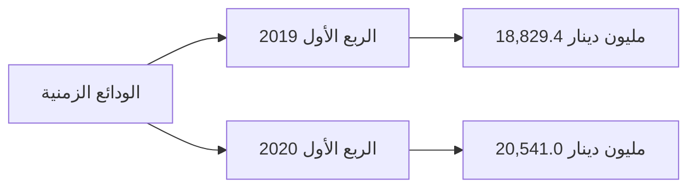

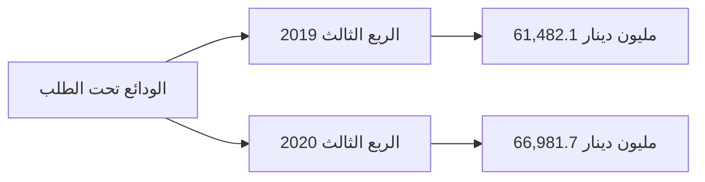

14
---
The following table shows the development of balances and deposits for banks with the central bank and other banks during the period (2012 - 2019):

| البيان | 2012 | 2013 | 2014 | 2015 | 2016 | 2017 | 2018 | 2019 |
|---------|------|------|------|------|------|------|------|------|
| ودائع تحت الطلب لدى : | 19,352.7 | 22,342.6 | 24,360.7 | 27,870.7 | 38,306.1 | 56,945.4 | 59,454.9 | 60,184.6 |
| - المصرف المركزي | 17,203.4 | 19,364.6 | 19,317.8 | 20,863.2 | 30,627.6 | 53,136.0 | 52,385.4 | 53,629.1 |
| - المصارف المحلية | 329.0 | 347.6 | 408.2 | 1,717.6 | 1,742.4 | 1,012.5 | 1,030.0 | 1,750.0 |
| - المصرف الليبي الخارجي | 664.7 | 848.1 | 1,850.0 | 2,216.8 | 2,396.1 | 874.2 | 1,762.1 | 821.4 |
| - المصارف بالخارج | 1,155.6 | 1,782.3 | 2,784.7 | 3,073.1 | 3,540.0 | 1,922.7 | 4,277.3 | 3,984.1 |
| ودائع زمنية : | 37,434.9 | 45,751.9 | 37,883.3 | 25,669.2 | 24,000.4 | 27,317.8 | 25,894.4 | 17,240.3 |
| - شهادات الإيداع | 35,737.8 | 44,307.3 | 37,074.6 | 24,259.7 | 23,187.1 | 26,415.7 | 24,716.9 | 15,846.8 |
| - المصارف المحلية | 0.0 | 30.0 | 0.0 | 0.0 | 0.0 | 0.0 | 0.0 | 0.0 |
| - المصرف الليبي الخارجي | 58.4 | 37.6 | 206.1 | 107.1 | 224.7 | 0.0 | 459.4 | 0.0 |
| - المصارف بالخارج | 1,638.7 | 1,377.0 | 602.6 | 1,302.4 | 588.6 | 902.1 | 718.1 | 1,393.5 |
| الإجمالي | 56,787.6 | 68,094.6 | 62,244.0 | 53,539.9 | 62,306.5 | 84,263.2 | 85,349.3 | 77,424.9 |

The image also includes a chart titled:

ودائع المصارف التجارية لدى المصرف المركزي والمصارف الأخرى
( 2012 - 2019 )

This chart shows the trends of two types of deposits from 2012 to 2019:
1. ودائع تحت الطلب لدى (Demand deposits)
2. ودائع زمنية (Time deposits)

The chart illustrates that demand deposits have generally increased over the period, while time deposits showed more fluctuation, peaking around 2013-2014 before declining in later years.
---
## 2- الإستثمارات :

سجل إجمالي بند رصيد الإستثمارات في المصارف التجارية نهاية الربع الثالث 2020 نحو 4,256.7 مليون دينار، مقابل 1,114.1 مليون دينار في نهاية الربع الثالث 2019، بمعدل نمو 282.1% هذا الإرتفاع جاء نتيجة للإستثمار في سندات وأذونات الخزانة بمبلغ 3.0 مليار دينار، والجدول التالي يوضح تفاصيل هذا البند:

| البيان | الربع الثالث 2019 | الربع الثالث 2020 | مقدار التغير | معدل التغير % |
|--------|-------------------|-------------------|---------------|---------------|
| سندات وأذونات الخزانة | 0.0 | 3,000.0 | 3,000.0 | - |
| إستثمارات في الشركات العامة | 562.4 | 562.4 | 0.0 | 0.0 |
| إستثمارات في الشركات الخاصة المساهمة | 496.9 | 599.4 | 102.5 | 20.6 |
| إستثمارات أخرى | 54.8 | 94.9 | 40.1 | 73.2 |
| الإجمالي | 1,114.1 | 4,256.7 | 3,142.6 | 282.1 |

إجمالي رصيد بند الإستثمارات

```mermaid
bar chart
    title إجمالي رصيد بند الإستثمارات
    x-axis [الربع الثالث 2019, الربع الثالث 2020]
    y-axis "مليون دينار" 0 --> 4500
    bar [1114.1, 4256.7]
```

16
---
والجدول التالي يبين تطور رصيد بند الإستثمارات للمصارف التجارية خلال الفترة (2012 - 2019):
" مليون دينار "

| البيان | 2012 | 2013 | 2014 | 2015 | 2016 | 2017 | 2018 | 2019 |
|--------|------|------|------|------|------|------|------|------|
| سندات وأذونات الخزانة | 0.0 | 0.0 | 0.0 | 1,000.0 | 1,000.0 | 500.0 | 500.0 | 700.0 |
| إستثمارات أخرى | 954.9 | 746.7 | 777.5 | 787.8 | 789.2 | 811.5 | 956.5 | 1,257.5 |
| الإجمالي | 954.9 | 746.7 | 777.5 | 1,787.8 | 1,789.2 | 1,311.5 | 1,456.5 | 1,957.5 |

إجمالي الإستثمارات في المصارف التجارية
(2012 - 2019)


3- القروض والتسهيلات الائتمانية :

إرتفع إجمالي رصيد الإئتمان الممنوح من المصارف التجارية من 16,689.5 مليون دينار في نهاية
الربع الثالث 2019 إلى 16,761.2 مليون دينار في نهاية الربع الثالث 2020، أي بمعدل نمو
0.4%، حيث بلغ رصيد القروض الممنوحة للقطاع الخاص في نهاية الربع الثالث 2019 ما قيمته
10,617.9 مليون دينار، وما نسبته 63.4% من إجمالي القروض والتسهيلات الائتمانية، فيما شكل
رصيد القروض الممنوحة للقطاع العام النسبة الباقية 36.6% والتي بلغت قيمتها 6,143.3 مليون
دينار.

وقد شكلت القروض والتسهيلات الائتمانية الممنوحة إلى إجمالي الخصوم الإيداعية ما نسبته 16.8%،
كما شكلت من إجمالي الأصول ما نسبته 13.4%

وبلغـــت نسبة تغطـــية مخصـــص الديون المشـــكوك فيها لإجمـــالي القروض والتسهيلات
الائتمانية والممنوحة نسبة 21.4% في نهاية الربع الثالث 2020 مقابل نسبة 20.7% في نهاية
الربع الثالث 2019.

17
---
وفيما يلي بيان تفصيلي لرصيد القروض والتسهيلات الممنوحة من المصارف التجارية :

| مليون دينار |  |  |  |  |
|---|---|---|---|---|
| معدل التغير % | مقدار التغير | الربع الثالث 2020 | الربع الثالث 2019 | البيان |
| 1.2 | 60.9 | 5,218.1 | 5,157.2 | سلفيات والسحب على المكشوف |
| 8.3 | 273.4 | 3,556.1 | 3,282.7 | السلف الإجتماعية * |
| -3.2 | -262.6 | 7,987.0 | 8,249.6 | القروض الأخرى |
| 0.4 | 71.7 | 16,761.2 | 16,689.5 | إجمالي القروض والتسهيلات |
| 3.6 | 126.0 | 3,585.5 | 3,459.5 | مخصص الديون |
| -0.4 | -54.3 | 13,175.7 | 13,230.0 | صافي القروض والتسهيلات |

* تشمل رصيد قروض المرابحة للأفراد .

| رصيد السلفيات والسحب على المكشوف | رصيد السلف الاجتماعية |
|---|---|
| Chart 1 | Chart 2 |

| مليون دينار |  |  |  |  |
|---|---|---|---|---|
| معدل التغير % | مقدار التغير | الربع الثالث 2020 | الربع الثالث 2019 | البيان |
| 6.1 | 350.5 | 6,143.3 | 5,792.8 | القروض الممنوحة للقطاع العام |
| -2.6 | -278.8 | 10,617.9 | 10,896.7 | القروض الممنوحة للقطاع الخاص |
| 0.4 | 71.7 | 16,761.2 | 16,689.5 | الإجمالي |

18
---
| رصيد القروض الممنوحة للقطاع الخاص | رصيد القروض الممنوحة للقطاع العام |
|----------------------------------------|---------------------------------------|
| Chart 1 | Chart 2 |

| مليون دينار | 2012 | 2013 | 2014 | 2015 | 2016 | 2017 | 2018 | 2019 | البيان |
|-------------|------|------|------|------|------|------|------|------|-------|
| 5,291.2 | 5,327.1 | 6,195.9 | 5,982.8 | 5,915.9 | 5,578.9 | 5,100.9 | 6,057.0 | القروض الممنوحة للقطاع العام |
| 10,608.3 | 12,905.5 | 13,764.0 | 14,230.1 | 12,854.3 | 11,867.7 | 11,347.4 | 10,855.8 | القروض الممنوحة للقطاع الخاص |
| 15,899.5 | 18,232.3 | 19,959.9 | 20,212.8 | 18,770.3 | 17,446.6 | 16,448.3 | 16,912.7 | الإجمالي |

وفيما يلي رصيد القروض والتسهيلات الممنوحة للقطاعين العام والخاص خلال الفترة (2012 -2019) :)

Chart 3

رصيد القروض الممنوحة للقطاعين ( العام والخاص )
( 2012 - 2019 )
---
وفيما يلي رصيد السلف الاجتماعية والسحب على المكشوف خلال الفترة (2012 -2019):

"مليون دينار"

| البيان | 2012 | 2013 | 2014 | 2015 | 2016 | 2017 | 2018 | 2019 |
|--------|------|------|------|------|------|------|------|------|
| سلفيات والسحب على المكشوف | 5,522.3 | 4,146.5 | 4,452.1 | 5,440.1 | 4,827.9 | 4,514.5 | 4,354.0 | 5,275.4 |
| السلف الاجتماعية * | 4,973.5 | 6,726.0 | 7,157.9 | 6,608.6 | 5,901.1 | 4,912.5 | 3,988.7 | 3,125.5 |
| القروض الأخرى | 5,403.7 | 3,759.8 | 8,348.9 | 8,164.2 | 8,041.3 | 8,019.6 | 8,105.6 | 8,511.8 |
| إجمالي القروض والتسهيلات | 15,899.5 | 18,232.3 | 19,959.9 | 20,212.8 | 18,770.3 | 17,446.6 | 16,448.3 | 16,912.7 |
| مخصص الديون | 2,348.9 | 2,497.9 | 2,688.1 | 2,779.7 | 2,910.0 | 3,040.8 | 3,126.4 | 3,503.6 |
| صافي القروض والتسهيلات | 13,550.6 | 15,734.4 | 17,271.8 | 17,433.1 | 15,860.3 | 14,405.8 | 13,321.9 | 13,409.1 |

*تشمل رصيد قروض المرابحة للأفراد


| السنة | السلف الاجتماعية | سلفيات والسحب على المكشوف |
|-------|------------------|---------------------------|
| 2012 | 4,973.5 | 5,522.3 |
| 2013 | 6,726.0 | 4,146.5 |
| 2014 | 7,157.9 | 4,452.1 |
| 2015 | 6,608.6 | 5,440.1 |
| 2016 | 5,901.1 | 4,827.9 |
| 2017 | 4,912.5 | 4,514.5 |
| 2018 | 3,988.7 | 4,354.0 |
| 2019 | 3,125.5 | 5,275.4 |

## 4- الأصول الثابتة والأصول الأخرى :

بلغ رصيد الأصول الثابتة نحو1,895.4 مليون دينار في نهاية الربع الثالث 2020، مقابل 1,706.6 مليون دينار في نهاية الربع الثالث 2019، فيما بلغ رصيد الأصول الأخرى نحو 6,989.6 مليون دينار في نهاية الربع الثالث 2020، مقابل 6,668.8 مليون دينار في نهاية الربع الثالث 2019.
---
## ثانياً : جانب الخصوم

### 1- ودائع العملاء لدى المصارف التجارية:

ارتفع إجمالي رصيد ودائع العملاء لدى المصارف التجارية من 91,421.8 مليون دينار في نهاية الربع الثالث 2019 إلى 99,935.9 مليون دينار في نهاية الربع الثالث 2020، أي بمعدل 9.3%، وقد تركز الارتفاع في أرصدة الودائع تحت الطلب بمقدار 8,157.1 مليون دينار، بنسبة 10.3%، وسجل رصيد الودائع لأجل ارتفاعاً مقداره 386.0 مليون دينار وبنسبة 3.4% عما كانت عليه في الربع الثالث 2019 ، في حين إنخفضت الودائع الإدخارية بمقدار 29.0 مليون دينار وبنسبة 6.3%.

وفيما يتعلق بتوزيع الودائع لدى المصارف التجارية حسب نوع الوديعة فقد شكلت الودائع تحت الطلب ما نسبته 87.8% من إجمالي الودائع، في حين شكلت الودائع لأجل ما نسبته 11.8% من إجمالي الودائع، وشكلت ودائع الادخار ما نسبته 0.4% فقط من إجمالي الودائع.

| مليون دينار |  |  |  |  |
|---|---|---|---|---|
| معدل التغير % | مقدار التغير | الربع الثالث 2020 | الربع الثالث 2019 | البيان |
| 10.3 | 8,157.1 | 87,701.5 | 79,544.4 | الودائع تحت الطلب |
| 3.4 | 386.0 | 11,801.5 | 11,415.5 | الودائع لأجل |
| -6.3 | -29.0 | 432.9 | 461.9 | الودائع الإدخارية |
| 9.3 | 8,514.1 | 99,935.9 | 91,421.8 | الإجمالي |

### رصيد ودائع العملاء لدى المصارف التجارية حسب نوع الوديعة

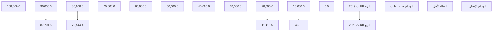

21
---
# أرصدة الودائع حسب نوع الوديعة لدى المصارف التجارية خلال الفترة (2012 - 2019)

"مليون دينار"

| البيان | 2012 | 2013 | 2014 | 2015 | 2016 | 2017 | 2018 | 2019 |
|--------|------|------|------|------|------|------|------|------|
| الودائع تحت الطلب | 54,728.8 | 61,834.9 | 56,641.4 | 58,725.9 | 72,192.7 | 84,827.6 | 80,038.6 | 77,919.6 |
| الودائع زمنية | 12,912.1 | 21,064.9 | 21,669.3 | 11,956.7 | 10,644.7 | 10,519.2 | 13,115.5 | 10,582.2 |
| الودائع الإدخارية | 705.3 | 662.9 | 599.8 | 574.5 | 570.2 | 591.7 | 503.4 | 452.3 |
| الإجمالي | 68,346.2 | 83,562.7 | 78,910.4 | 71,257.1 | 83,407.6 | 95,938.5 | 93,657.5 | 88,954.0 |

## إجمالي أرصدة ودائع العملاء لدى المصارف التجارية (2012 - 2019)

```mermaid
graph TD
    A[2012] --> B[2013] --> C[2014] --> D[2015] --> E[2016] --> F[2017] --> G[2018] --> H[2019]
    style A fill:#0000FF,stroke:#333,stroke-width:2px
    style B fill:#0000FF,stroke:#333,stroke-width:2px
    style C fill:#0000FF,stroke:#333,stroke-width:2px
    style D fill:#0000FF,stroke:#333,stroke-width:2px
    style E fill:#0000FF,stroke:#333,stroke-width:2px
    style F fill:#0000FF,stroke:#333,stroke-width:2px
    style G fill:#0000FF,stroke:#333,stroke-width:2px
    style H fill:#0000FF,stroke:#333,stroke-width:2px
    
    A1[ودائع تحت الطلب] --> B1[ودائع تحت الطلب] --> C1[ودائع تحت الطلب] --> D1[ودائع تحت الطلب] --> E1[ودائع تحت الطلب] --> F1[ودائع تحت الطلب] --> G1[ودائع تحت الطلب] --> H1[ودائع تحت الطلب]
    style A1 fill:#FF0000,stroke:#333,stroke-width:2px
    style B1 fill:#FF0000,stroke:#333,stroke-width:2px
    style C1 fill:#FF0000,stroke:#333,stroke-width:2px
    style D1 fill:#FF0000,stroke:#333,stroke-width:2px
    style E1 fill:#FF0000,stroke:#333,stroke-width:2px
    style F1 fill:#FF0000,stroke:#333,stroke-width:2px
    style G1 fill:#FF0000,stroke:#333,stroke-width:2px
    style H1 fill:#FF0000,stroke:#333,stroke-width:2px
    
    A2[ودائع زمنية] --> B2[ودائع زمنية] --> C2[ودائع زمنية] --> D2[ودائع زمنية] --> E2[ودائع زمنية] --> F2[ودائع زمنية] --> G2[ودائع زمنية] --> H2[ودائع زمنية]
    style A2 fill:#000000,stroke:#333,stroke-width:2px
    style B2 fill:#000000,stroke:#333,stroke-width:2px
    style C2 fill:#000000,stroke:#333,stroke-width:2px
    style D2 fill:#000000,stroke:#333,stroke-width:2px
    style E2 fill:#000000,stroke:#333,stroke-width:2px
    style F2 fill:#000000,stroke:#333,stroke-width:2px
    style G2 fill:#000000,stroke:#333,stroke-width:2px
    style H2 fill:#000000,stroke:#333,stroke-width:2px
    
    A3[إجمالي الودائع] --> B3[إجمالي الودائع] --> C3[إجمالي الودائع] --> D3[إجمالي الودائع] --> E3[إجمالي الودائع] --> F3[إجمالي الودائع] --> G3[إجمالي الودائع] --> H3[إجمالي الودائع]
    style A3 fill:#00FF00,stroke:#333,stroke-width:2px
    style B3 fill:#00FF00,stroke:#333,stroke-width:2px
    style C3 fill:#00FF00,stroke:#333,stroke-width:2px
    style D3 fill:#00FF00,stroke:#333,stroke-width:2px
    style E3 fill:#00FF00,stroke:#333,stroke-width:2px
    style F3 fill:#00FF00,stroke:#333,stroke-width:2px
    style G3 fill:#00FF00,stroke:#333,stroke-width:2px
    style H3 fill:#00FF00,stroke:#333,stroke-width:2px
```

وفيما يتعلق بتوزيع إجمالي ودائع العملاء لدى المصارف التجارية ( خاص ، حكومة، عام ) فقد إرتفعت ودائع القطاع الخاص بمقدار 5,808.7 مليون دينار وبنسبة 11.6% في نهاية الربع الثالث 2020، لتسجل نحو 56,057.2 مليون دينار، مقارنة بنحو 50,248.5 مليون دينار في نهاية الربع الثالث 2019 ، حيث سجل الإرتفاع في ودائع الأفراد بنحو 4,254.0 مليون دينار.

فيما ارتفع رصيد ودائع القطاع العام والقطاع الحكومي في نهاية الربع الثالث 2020 بمقدار 2,705.4 مليون دينار لتصل إلى 43,878.7 مليون دينار، منها 13298.0 مليون دينار كودائع حكومية والتي تتكون من ودائع الوزارات والهيئات والمؤسسات الحكومية وودائع كل من: صندوق الضمان الإجتماعي، صندوق الإنماء الإقتصادي والإجتماعي وودائع الصندوق الليبي للتنمية والإستثمار، مقابل 41,173.3 مليون دينار كودائع للقطاع العام والقطاع الحكومي في نهاية الربع الثالث 2019.
---
والجدول التالي يوضح تطور أرصدة الودائع لدى المصارف التجارية :

"مليون دينار"

| البيان | الربع الثالث 2019 | الربع الثالث 2020 | مقدار التغير | معدل التغير % |
|------|-----------------|-----------------|-------------|--------------|
| ودائع الحكومة والقطاع العام | 41,173.3 | 43,878.7 | 2,705.4 | 6.6 |
| - ودائع حكومية | 10,776.1 | 13,298.0 | 2,521.9 | 23.4 |
| - ودائع القطاع العام | 30,397.1 | 30,580.7 | 183.6 | 0.6 |
| ودائع القطاع الخاص | 50,248.5 | 56,057.2 | 5,808.7 | 11.6 |
| - الأفراد | 30,687.9 | 34,941.9 | 4,254.0 | 13.9 |
| - الشركات والمؤسسات | 19,560.7 | 21,115.3 | 1,554.6 | 7.9 |
| الإجمالي | 91,421.8 | 99,935.9 | 8,514.1 | 9.3 |

ودائع القطاع الخاص لدى المصارف التجارية:

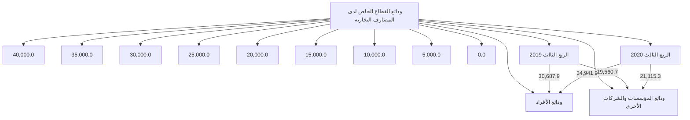

ودائع القطاع العام والحكومي لدى المصارف التجارية:

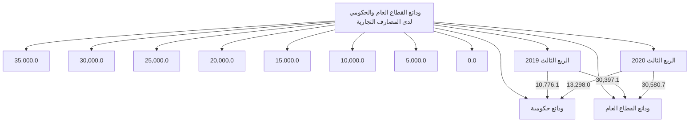
---
وفيما يلي توزيع ودائع العملاء لدى المصارف التجارية خلال الفترة (2012 - 2019):

*مليون دينار

| البيان | 2012 | 2013 | 2014 | 2015 | 2016 | 2017 | 2018 | 2019 |
|--------|------|------|------|------|------|------|------|------|
| ودائع الحكومة والقطاع العام | 35,469.8 | 52,638.7 | 46,339.9 | 35,139.7 | 39,197.7 | 40,710.8 | 39,747.8 | 42,343.0 |
| - ودائع حكومية | 13,983.3 | 24,285.4 | 21,987.0 | 9,800.6 | 9,100.7 | 9,234.8 | 10,048.5 | 11,694.6 |
| - ودائع القطاع العام | 21,486.5 | 28,353.3 | 24,352.9 | 25,339.1 | 30,097.0 | 31,476.0 | 29,699.3 | 30,648.5 |
| ودائع القطاع الخاص | 32,876.4 | 30,924.0 | 32,570.5 | 36,117.4 | 44,209.9 | 55,227.7 | 53,909.7 | 46,611.0 |
| - الأفراد | 21,026.1 | 19,569.5 | 19,799.0 | 20,477.2 | 27,605.5 | 36,295.4 | 33,717.5 | 27,402.6 |
| - الشركات والمؤسسات | 11,850.3 | 11,345.5 | 12,771.5 | 15,640.2 | 16,604.4 | 18,932.3 | 20,192.2 | 19,208.4 |
| الإجمالي | 68,346.2 | 83,562.7 | 78,910.4 | 71,257.1 | 83,407.6 | 95,938.5 | 93,657.5 | 88,954.0 |

ودائع القطاع العام والقطاع الحكومي لدى المصارف التجارية
( 2012 - 2019 )

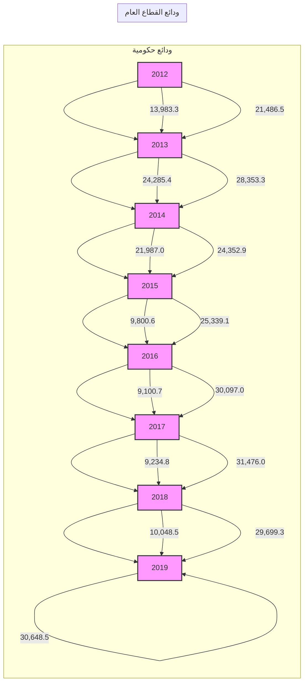
---
# ودائع القطاع الخاص لدى المصارف التجارية
## (2012 - 2019)

```
| السنة | ودائع الشركات والمؤسسات | ودائع الأفراد |
|-------|--------------------------|---------------|
| 2012  | 11,850.3                 | 21,026.1      |
| 2013  | 11,813.8                 | 19,569.5      |
| 2014  | 12,771.5                 | 19,799.0      |
| 2015  | 15,640.2                 | 20,477.2      |
| 2016  | 16,604.4                 | 27,605.5      |
| 2017  | 18,932.3                 | 36,295.4      |
| 2018  | 20,192.2                 | 33,717.5      |
| 2019  | 19,208.4                 | 27,402.6      |
```

## 2- الحسابات المكشوفة لدى المراسلين بالخارج:

بلغ رصيد الحسابات المكشوفة لدى المراسلين بالخارج 224.1 مليون دينار في نهاية الربع الثالث 2020، وهي في معظمها ناتجة عن تأخر تسوية الحسابات لبعض المصارف مع المصارف المراسلة بالخارج، مقابل 354.8 مليون دينار في نهاية نفس الفترة من عام 2019.

| البيان | الربع الثالث 2019 | الربع الثالث 2020 | مقدار التغير | معدل التغير % |
|--------|-------------------|-------------------|---------------|---------------|
| الحسابات المكشوفة لدى المراسلين بالخارج | 354.8 | 224.1 | -130.7 | -36.8 |

*مليون دينار

### الحسابات المكشوفة لدى المراسلين بالخارج

```
| الربع الثالث 2019 | الربع الثالث 2020 |
|-------------------|-------------------|
| 354.8             | 224.1             |
```

وفيما يلي أرصدة الحسابات المكشوفة خلال الفترة (2012 - 2019):

| البيان | 2012 | 2013 | 2014 | 2015 | 2016 | 2017 | 2018 | 2019 |
|--------|------|------|------|------|------|------|------|------|
| الحسابات المكشوفة لدى المراسلين بالخارج | 139.6 | 74.9 | 432.0 | 955.6 | 429.9 | 368.5 | 503.4 | 113.1 |

*مليون دينار
---

Chart showing "Balance of uncovered accounts for correspondents abroad" from 2012 to 2019

| Year | Value |
|------|-------|
| 2012 | 139.6 |
| 2013 | 74.9  |
| 2014 | 432.0 |
| 2015 | 955.6 |
| 2016 | 430.9 |
| 2017 | 368.5 |
| 2018 | 503.4 |
| 2019 | 113.1 |

### 3- حقوق الملكية والأرباح:

- رأس المال المدفوع: ارتفع رأس المال المدفوع من 4,263.3 مليون دينار في نهاية الربع الثالث 2019 إلى 4,295.9 مليون دينار في الربع الثالث 2020، نتيجة لقيام بعض المصارف بزيادة رأس مالها المدفوع.

- الاحتياطيات والأرباح: ارتفع رصيد الاحتياطيات والأرباح المرحلة والقابلة للتوزيع من 2,167.9 مليون دينار في نهاية الربع الثالث 2019، ليصل إلى 2,303.5 مليون دينار في نهاية الربع الثالث 2020، في حين تراجعت أرباح المصارف التجارية قبل خصم المخصصات والضرائب خلال التسعة أشهر الأولى من عام 2020 بمعدل 39.7% لتسجل إلى 405.7 مليون دينار، مقارنة عما كانت عليه خلال نفس الفترة من عام 2019 والبالغة نحو 672.8 مليون دينار.

"مليون دينار"

| البيان | الربع الثالث 2019 | الربع الثالث 2020 | مقدار التغير | معدل التغير % |
|--------|-------------------|-------------------|---------------|---------------|
| رأس المال المدفوع | 4,263.3 | 4,295.9 | 32.6 | 0.8 |
| الاحتياطي القانوني | 513.0 | 565.2 | 52.2 | 10.2 |
| احتياطيات غير مخصصة | 33.1 | 34.3 | 1.2 | 3.6 |
| أرباح العام | 672.8 | 405.7 | -267.1 | -39.7 |
| الأرباح المرحلة والأرباح القابلة للتوزيع | 1,621.8 | 1,704.0 | 82.2 | 5.1 |
| الإجمالي | 7,104.0 | 7,005.1 | -98.9 | -1.4 |

26
---
# أرباح الفترة قبل خصم المخصصات والضرائب

| الربع الثالث 2020 | الربع الثالث 2019 |
|-------------------|-------------------|
| 405.7             | 672.8             |

*القيم بالمليون دينار*

# أرباح المصارف التجارية قبل خصم المخصصات والضرائب (2012 - 2019)

| السنة | القيمة |
|-------|--------|
| 2012  | 527.1  |
| 2013  | 451.1  |
| 2014  | 265.4  |
| 2015  | 213.0  |
| 2016  | 247.1  |
| 2017  | 464.6  |
| 2018  | 1222.2 |
| 2019  | 867.6  |

*القيم بالمليون دينار*

وفيما يلي حسابات رأس المال والإحتياطيات في المصارف خلال الفترة (2012 - 2019):

| البيان | 2012 | 2013 | 2014 | 2015 | 2016 | 2017 | 2018 | 2019 |
|--------|------|------|------|------|------|------|------|------|
| رأس المال المدفوع | 3,495.2 | 3,550.2 | 3,566.8 | 3,609.5 | 3,791.4 | 3,806.4 | 3,904.4 | 4,282.9 |
| الإحتياطي القانوني | 181.9 | 323.5 | 335.8 | 335.8 | 342.8 | 346.1 | 352.9 | 527.7 |
| إحتياطيات غير مخصصة | 26.6 | 29.7 | 29.7 | 29.7 | 30.0 | 31.9 | 32.0 | 53.1 |
| أرباح العام | 527.1 | 451.1 | 265.4 | 213.0 | 247.1 | 464.6 | 1,122.2 | 867.6 |
| الأرباح المرحلة والأرباح القابلة للتوزيع | 422.4 | 389.2 | 688.7 | 899.6 | 955.0 | 912.4 | 1,061.1 | 1,245.5 |
| الإجمالي | 4,653.2 | 4,743.7 | 4,886.4 | 5,087.6 | 5,366.3 | 5,561.4 | 6,472.6 | 6,976.8 |

*مليون دينار
---
# إجمالي حقوق الملكية في المصارف التجارية
## (2012 - 2019)

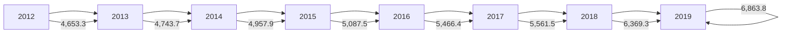

| السنة | رأس المال | الاحتياطيات | إجمالي حقوق الملكية |
|-------|-----------|-------------|---------------------|
| 2012  | ~3,500    | ~1,100      | 4,653.3             |
| 2013  | ~3,600    | ~1,100      | 4,743.7             |
| 2014  | ~3,700    | ~1,200      | 4,957.9             |
| 2015  | ~3,800    | ~1,300      | 5,087.5             |
| 2016  | ~3,900    | ~1,500      | 5,466.4             |
| 2017  | ~4,000    | ~1,600      | 5,561.5             |
| 2018  | ~4,100    | ~2,300      | 6,369.3             |
| 2019  | ~4,500    | ~2,300      | 6,863.8             |

## 4- المخصصات :

سجل رصيد المخصصات إرتفاعاً بمقدار 239.5 مليون دينار في نهاية الربع الثالث 2020 ليصل إلى 5,610.8 مليون دينار، مقابل 5,371.3 مليون دينار في نهاية الربع الثالث 2019، وتركزت الزيادة في بند مخصص الديون المشكوك في تحصيلها كما هو موضح بالجدول التالي :

| البيان | الربع الثالث 2019 | الربع الثالث 2020 | مقدار التغير | معدل التغير % |
|--------|-------------------|-------------------|---------------|---------------|
| مخصص الديون المشكوك في تحصيلها | 3,459.5 | 3,585.5 | 126.0 | 3.6 |
| مخصص إستهلاك الأصول الثابتة | 775.2 | 837.5 | 62.3 | 8.0 |
| مخصصات عامة | 1,134.5 | 1,147.6 | 13.1 | 1.2 |
| مخصص تقييم أسعار الصرف | 2.2 | 0.8 | -1.4 | -63.6 |
| الإجمالي | 5,371.3 | 5,571.5 | 200.2 | 3.7 |

## بند المخصصات

| البيان | الربع الثالث 2019 | الربع الثالث 2020 |
|--------|-------------------|-------------------|
| مخصص الديون المشكوك في تحصيلها | 3,459.5 | 3,585.5 |
| مخصص إستهلاك الأصول الثابتة | 775.2 | 837.5 |
| مخصصات عامة | 1,134.5 | 1,147.6 |
---
وفيما يلي رصيد المخصصات خلال الفترة (2012 - 2019):

"مليون دينار"

| البيان | 2012 | 2013 | 2014 | 2015 | 2016 | 2017 | 2018 | 2019 |
|--------|------|------|------|------|------|------|------|------|
| مخصص الديون المشكوك في تحصيلها | 2,348.9 | 2,497.5 | 2,688.1 | 2,779.7 | 2,910.0 | 3,040.8 | 3,126.4 | 3,503.6 |
| مخصص استهلاك الأصول الثابتة | 424.1 | 473.1 | 539.3 | 592.5 | 634.0 | 687.3 | 745.2 | 795.3 |
| مخصصات عامة | 539.3 | 614.6 | 532.8 | 556.9 | 594.3 | 738.2 | 753.2 | 1,225.5 |
| مخصص تقييم أسعار الصرف | 5.2 | 11.6 | 5.1 | 12.7 | 6.5 | 6.7 | 2.8 | 2.8 |
| الإجمالي | 3,317.5 | 3,597.2 | 3,765.3 | 3,941.8 | 4,144.8 | 4,473.0 | 4,627.6 | 5,527.2 |

رصيد مخصص الديون المشكوك في تحصيلها
( 2012 - 2019 )

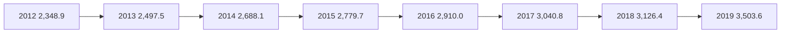

5- متنوعات وخصوم أخرى :

بلغ رصيد متنوعات وخصوم أخرى 12,746.5 مليون دينار في نهاية الربع الثالث 2020 مقابل
14,380.9 مليون دينار في نهاية الربع الثالث 2019.

29
---
# مؤشرات السلامة المالية للمصارف التجارية
## (2012 - الربع الثالث 2020)

❖ مؤشرات السيولة : بلغت نسبة الأصول السائلة لدى المصارف التجارية إلى إجمالي الأصول 71.4%
في نهاية الربع الثالث 2020، والتي معظمها تمثل ودائع لدى المصرف المركزي ( تحت الطلب بما فيها
الإحتياطي الإلزامي وكذلك شهادات الإيداع ) .

وبلغ حجم القروض إلى إجمالي الودائع بالقطاع المصرفي نسبة 16.8% في نهاية الربع الثالث 2020،
وهي نسبة ضئيلة للغاية، حيث لم تتعدى هذه النسبة 28.4% خلال الفترة ( 2012 - الربع الثالث 2020).

وتجدر الإشارة إلى أن نسبة السيولة القانونية المطلوب من المصارف التجارية الإحتفاظ بها هي 25.0%
من إجمالي الخصوم الإيداعية.

| مؤشرات السيولة | 2012 | 2013 | 2014 | 2015 | 2016 | 2017 | 2018 | 2019 | الربع الثالث 2020 |
|-----------------|------|------|------|------|------|------|------|------|-------------------|
| الأصول السائلة / الأصول | 68.6 | 71.0 | 67.8 | 60.2 | 60.8 | 72.8 | 74.3 | 71.9 | 71.4 |
| القروض / الودائع | 23.6 | 21.8 | 25.2 | 28.4 | 22.5 | 18.2 | 17.6 | 19.0 | 16.8 |
| الودائع / الأصول | 80.8 | 84.9 | 83.1 | 79.0 | 80.6 | 82.4 | 80.0 | 79.3 | 80.1 |

## مؤشرات السيولة
### (2012 - الربع الثالث 2020)

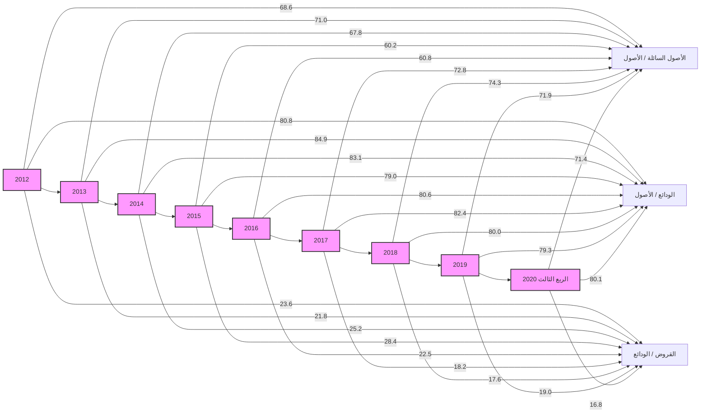

30
---
# جودة الأصول

أظهرت البيانات المتوفرة عن نسبة الديون المتعثرة وهي بيانات تقديرية قد لا تعكس الواقع أن نسبة الديون المتعثرة إلى إجمالي القروض بلغت في نهاية الربع الثالث 2020 نحو 21.0%، ويدل ارتفاع هذه النسبة على انخفاض كفاءة إدارة الائتمان، وينبغي أن لا تتجاوز هذه النسبة وفقاً للمعايير الدولية 5%. وقد سجلت نسبة تغطية مخصص الديون إلى الديون المتعثرة في نهاية الربع الثالث 2020 نحو 101.9%.

| نسب مئوية | 2012 | 2013 | 2014 | 2015 | 2016 | 2017 | 2018 | 2019 | الربع الثالث 2020 |
|-----------|------|------|------|------|------|------|------|------|-------------------|
| جودة الأصول | | | | | | | | | |
| القروض المتعثرة / الأصول | 4.0 | 3.9 | 4.4 | 4.7 | 3.8 | 3.1 | 2.9 | 3.2 | 2.8 |
| القروض المتعثرة / القروض | 21.0 | 21.0 | 21.0 | 21.0 | 21.0 | 21.0 | 21.0 | 21.0 | 21.0 |
| مخصص الديون / القروض المتعثرة | 70.9 | 65.2 | 64.0 | 65.5 | 73.8 | 83.0 | 90.4 | 98.6 | 101.9 |
| مخصص الديون / القروض | 14.9 | 13.7 | 13.4 | 13.8 | 15.5 | 17.4 | 19.0 | 20.9 | 21.4 |

- بيانات القروض المتعثرة تقديرية منذ 2011

## مؤشرات جودة الأصول (2012 - الربع الثالث 2020)

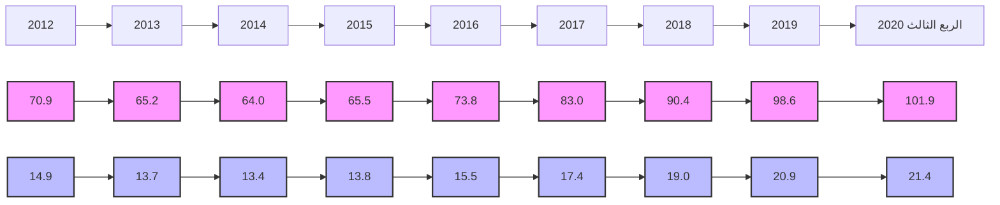

# الربحية

شهد معدل العائد على الأصول لدى القطاع المصرفي في ليبيا انخفاضاً ملحوظاً خلال السنوات (2014 - 2016)، حيث بلغ نحو 0.2% في عام 2016، ويعزى سبب الانخفاض إلى عدة أسباب منها الوضع الغير ملائم الذي تعمل فيه المصارف التجارية في السنوات الأخيرة وكذلك تطبيق قانون إلغاء الفوائد الربوية.

إلا أنه خلال العام 2018 تحسن معدل الربحية بشكل كبير، حيث بلغ العائد على إجمالي الأصول نحو 1.0%، وبلغ معدل العائد على حقوق الملكية 20.9%.
---
وفي عام 2019 بلغ معدل العائد على إجمالي الأصول نحو 0.7% وبلغ معدل العائد على حقوق الملكية 12.3%.

وفي الربع الثالث من العام 2020 إنخفضت مؤشرات الربحية ليبلغ معدل العائد إلى إجمالي الأصول نحو 0.3% وبلغ معدل العائد إلى حقوق الملكية نحو 6.2%.

الزيادة في الأرباح في عامي 2018 و2019 جاءت نتيجة لتحقيق المصارف التجارية لإيرادات هامة من عمولات بيع وتحويل العملة الأجنبية ، وكذلك من رفع أسعار الخدمات المصرفية عموماً.

| نسب مئوية |  |  |  |  |  |  |  |  |  |
|-----------|-----|-----|-----|-----|-----|-----|-----|-----|-----|
| الربع الثالث 2020 | 2019 | 2018 | 2017 | 2016 | 2015 | 2014 | 2013 | 2012 | الربحية |
| 4.9 | 12.3 | 20.9 | 9.1 | 4.8 | 4.4 | 5.4 | 12.0 | 13.7 | العائد / حقوق الملكية |
| 0.3 | 0.7 | 1.0 | 0.4 | 0.2 | 0.2 | 0.3 | 0.5 | 0.7 | العائد / الاصول |

## العائد / الأصول
### (2012 - الربع الثالث 2020)

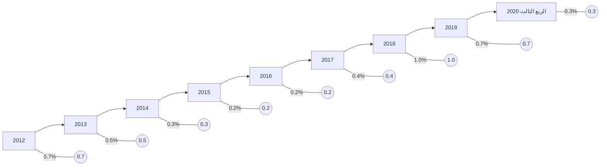

## العائد / حقوق الملكية
### (2012 - الربع الثالث 2020)

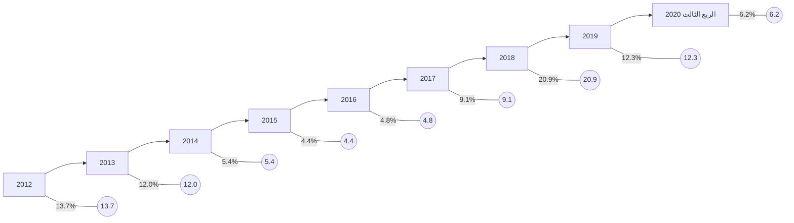

32
---
# كفاية رأس المال

يتمتع القطاع المصرفي الليبي بكفاية رأس مال مرتفعة، كافية لمواجهة أية مخاطر قد تحدث، حيث تراوحت نسبتها مابين 10.7% و 18.8% خلال الفترة ( 2012 - الربع الثالث 2020)، وهي بشكل عام أعلى وبهامش مريح من النسبة المحددة من قبل لجنة بازل (1) والبالغة 8.0%، مما يعزز من الإستقرار المالي.

## نسب مئوية

| نسب رأس المال | 2012 | 2013 | 2014 | 2015 | 2016 | 2017 | 2018 | 2019 | الربع الثالث 2020 |
|---------------|------|------|------|------|------|------|------|------|-------------------|
| كفاية رأس المال الكلي | 10.7 | 12.4 | 13.9 | 14.3 | 14.6 | 16.7 | 17.8 | 18.4 | 18.8 |
| كفاية رأس المال الأساسي | 9.5 | 11.0 | 12.6 | 13.1 | 13.4 | 15.4 | 16.5 | 17.2 | 17.5 |
| راس المال المدفوع / الأصول | 4.2 | 3.6 | 3.7 | 4.0 | 3.7 | 3.3 | 3.3 | 3.8 | 3.6 |
| حقوق الملكية / الأصول | 5.1 | 4.4 | 5.1 | 5.4 | 4.9 | 4.8 | 4.6 | 5.5 | 5.5 |
| حقوق الملكية / الودائع | 6.3 | 5.1 | 6.2 | 7.1 | 6.1 | 5.3 | 5.7 | 6.9 | 7.1 |

## كفاية رأس المال الكلي (2012 - الربع الثالث 2020)


## مؤشرات رأس المال (2012 - الربع الثالث 2020)

```mermaid
graph LR
    2012[2012] --> |راس المال المدفوع / الأصول 4.2| 2013[2013]
    2012 --> |حقوق الملكية / الأصول 5.1| 2013
    2013 --> |راس المال المدفوع / الأصول 3.6| 2014[2014]
    2013 --> |حقوق الملكية / الأصول 4.4| 2014
    2014 --> |راس المال المدفوع / الأصول 3.7| 2015[2015]
    2014 --> |حقوق الملكية / الأصول 5.1| 2015
    2015 --> |راس المال المدفوع / الأصول 4.0| 2016[2016]
    2015 --> |حقوق الملكية / الأصول 5.4| 2016
    2016 --> |راس المال المدفوع / الأصول 3.7| 2017[2017]
    2016 --> |حقوق الملكية / الأصول 4.9| 2017
    2017 --> |راس المال المدفوع / الأصول 3.3| 2018[2018]
    2017 --> |حقوق الملكية / الأصول 4.8| 2018
    2018 --> |راس المال المدفوع / الأصول 3.3| 2019[2019]
    2018 --> |حقوق الملكية / الأصول 4.6| 2019
    2019 --> |راس المال المدفوع / الأصول 3.8| 2020[الربع الثالث 2020]
    2019 --> |حقوق الملكية / الأصول 5.5| 2020
```
---
# الملحق

❖ البيانات والمؤشرات المالية للمصارف التجارية للربع الثالث 2020 مقارنة بالربع الثالث 2019.

❖ جدول مؤشرات السلامة المالية خلال الفترة ( 2012 - الربع الثالث 2020 ) .

34
---
# الجدول (1)
## البيانات المالية الأساسية للمصارف التجارية
(مليون دينار)

| البيان / الفترة | سبتمبر 2019 | سبتمبر 2020 | معدل التغير % |
|-----------------|--------------|--------------|---------------|
| إجمالي الميزانية (الأصول + الحسابات النظامية) | 160,449.3 | 159,042.0 | -0.9 |
| إجمالي الأصول | 117,605.2 | 124,802.7 | 6.1 |
| إجمالي النقدية بخزائن المصارف | 2,874.2 | 1,590.9 | -44.6 |
| إجمالي الودائع لدى المصرف المركزي | 72,208.2 | 82,611.8 | 14.4 |
| إجمالي الودائع لدى المصارف | 2,425.1 | 1,096.2 | -54.8 |
| إجمالي الودائع لدى المصرف الليبي الخارجي | 637.1 | 559.6 | -12.2 |
| إجمالي الودائع لدى المراسلين بالخارج | 5,041.1 | 3,255.0 | -35.4 |
| إجمالي حسابات المقاصة | 8,240.6 | 5,744.7 | -30.3 |
| إجمالي القروض والسلفيات والتسهيلات | 16,689.5 | 16,761.2 | 0.4 |
| إجمالي الاستثمارات | 1,114.1 | 4,256.7 | 282.1 |
| إجمالي ودائع العملاء | 91,421.8 | 99,935.9 | 9.3 |
| إجمالي الحسابات المكشوفة لدى المراسلين | 354.8 | 224.1 | -36.9 |
| إجمالي حقوق الملكية | 6,431.2 | 6,546.8 | 1.8 |
| إجمالي المخصصات | 5,371.3 | 5,571.5 | 3.7 |
| أرباح العام | 672.8 | 405.7 | -39.7 |
| عدد الفروع والوكالات | 535 | 550 | 2.8 |
| عدد العاملين | 19,463 | 19,565 | 0.5 |
| الأصول السائلة / إجمالي الأصول % | 70.7 | 71.4 | - |
| إجمالي القروض / إجمالي الأصول % | 14.2 | 13.4 | - |
| حقوق الملكية / إجمالي الأصول % | 5.5 | 5.2 | - |
| إجمالي الأصول / عدد الفروع (مليون دينار) | 219.8 | 226.9 | - |
| إجمالي الأصول / عدد العاملين (مليون دينار) | 6.0 | 6.4 | - |
| إجمالي القروض / إجمالي الودائع % | 18.3 | 16.8 | - |
| إجمالي الربح / الأصول % (*) | 0.6 | 0.3 | - |
| إجمالي الربح / حقوق الملكية % (*) | 10.5 | 6.2 | - |

(*) إجمالي الربح قبل خصم المخصصات والضرائب.
---
# الجدول (2)
## مؤشرات الودائع لدى المصارف التجارية
(مليون دينار)

| البيان / الفترة | سبتمبر 2019 | سبتمبر 2020 | معدل التغير % |
|-----------------|-------------|-------------|---------------|
| 1- ودائع الحكومة والقطاع العام | 41,173.3 | 43,878.7 | 6.6 |
| ــ ودائع الحكومة (الوزارات والهيئات الممولة من الميزانية العامة) | 10,776.1 | 13,298.0 | 23.4 |
| ــ ودائع القطاع العام | 30,397.1 | 30,580.7 | 0.6 |
| 2- ودائع القطاع الخاص | 50,248.5 | 56,057.2 | 11.6 |
| ــ ودائع الأفراد | 30,687.9 | 34,941.9 | 13.9 |
| ــ ودائع الشركات والجهات الأخرى | 19,560.7 | 21,115.3 | 7.9 |
| إجمالي الودائع | 91,421.8 | 99,935.9 | 9.3 |
| الودائع تحت الطلب | 79,544.4 | 87,701.5 | 10.3 |
| الودائع لأجل | 11,415.5 | 11,801.5 | 3.4 |
| ودائع الادخار | 461.9 | 432.9 | -6.3 |
| الودائع تحت الطلب / إجمالي الودائع % | 87.0 | 87.8 | - |
| الودائع لأجل / إجمالي الودائع % | 12.5 | 11.8 | - |
| ودائع الادخار / إجمالي الودائع % | 0.5 | 0.4 | - |
| إجمالي الودائع / إجمالي الخصوم % | 77.7 | 80.1 | - |
---
# الجدول (3)
## مؤشرات الائتمان لدى المصارف التجارية
(مليون دينار)

| البيان / الفترة | سبتمبر 2019 | سبتمبر 2020 | معدل التغير % |
|-----------------|-------------|-------------|---------------|
| 1- الائتمان الممنوح للقطاع العام | 5,792.8 | 6,143.3 | 6.1 |
| 2- الائتمان الممنوح للقطاع الخاص | 10,896.7 | 10,617.9 | -2.6 |
| إجمالي الائتمان | 16,689.5 | 16,761.2 | 0.4 |
| السلفيات والسحب على المكشوف | 5,157.2 | 5,218.1 | 1.2 |
| السلف الاجتماعية (*) | 3,282.7 | 3,556.1 | 8.3 |
| السلفيات والسحب على المكشوف والسلف الاجتماعية | 8,439.9 | 8,774.2 | 4.0 |
| القروض الممنوحة للأنشطة الاقتصادية الأخرى | 8,249.6 | 7,987.0 | -3.2 |
| السلف الاجتماعية (*) / إجمالي الائتمان % | 19.7 | 21.2 | 7.9 |
| السلفيات والسحب على المكشوف / إجمالي الائتمان % | 30.9 | 31.1 | 0.7 |
| القروض الممنوحة للأنشطة الاقتصادية الأخرى/إجمالي الائتمان% | 49.4 | 47.7 | -3.6 |
| إجمالي الائتمان / إجمالي الأصول % | 14.2 | 13.4 | -5.4 |
| إجمالي الائتمان / إجمالي الودائع % | 18.3 | 16.8 | -8.1 |

(*) تشمل قروض المرابحة الإسلامية للأفراد ابتداءً من العام 2013.
---
# مؤشرات السلامة المالية للمصارف التجارية
## (2012 - الربع الثالث 2020)
نسب مئوية (%)

| المؤشر | 2012 | 2013 | 2014 | 2015 | 2016 | 2017 | 2018 | 2019 | الربع الثالث 2020 |
|--------|------|------|------|------|------|------|------|------|------------------|
| **مؤشرات رأس المال:** |
| معدل كفاية رأس المال الكلي % | 10.7 | 12.4 | 13.9 | 14.3 | 14.6 | 16.7 | 17.8 | 18.4 | 18.2 |
| معدل كفاية رأس المال الأساسي % | 9.5 | 11.0 | 12.6 | 13.1 | 13.4 | 15.4 | 16.5 | 17.2 | 16.9 |
| راس المال المدفوع / إجمالي الأصول % | 4.2 | 3.6 | 3.7 | 4.0 | 3.7 | 3.3 | 3.3 | 3.8 | 3.6 |
| حقوق الملكية / إجمالي الأصول % | 5.1 | 4.4 | 5.1 | 5.6 | 4.9 | 4.8 | 4.6 | 5.5 | 5.5 |
| حقوق الملكية / إجمالي الودائع % | 6.3 | 5.1 | 6.2 | 7.1 | 6.1 | 5.3 | 5.7 | 6.9 | 7.1 |
| **مؤشرات جودة الأصول:** |
| القروض المتعثرة (*) / إجمالي الأصول % | 4.0 | 3.9 | 4.4 | 4.7 | 3.8 | 3.1 | 2.9 | 3.2 | 2.8 |
| القروض المتعثرة (*) / إجمالي القروض % | 21.0 | 21.0 | 21.0 | 21.0 | 21.0 | 21.0 | 21.0 | 21.0 | 21.0 |
| مخصص الديون / إجمالي القروض المتعثرة (*)% | 70.9 | 65.2 | 64.0 | 65.5 | 73.8 | 83.0 | 90.4 | 98.6 | 101.9 |
| مخصص الديون / إجمالي القروض % | 14.9 | 13.7 | 13.4 | 13.8 | 15.5 | 17.4 | 19.0 | 20.9 | 21.4 |
| **مؤشرات كفاءة الإدارة:** |
| إجمالي القروض / إجمالي الأصول % | 19.1 | 18.3 | 21.0 | 22.4 | 18.1 | 15.0 | 14.1 | 15.1 | 13.4 |
| المصروفات / الإيرادات % | 57.2 | 62.8 | - | 65.4 | 70.3 | - | - | - | - |
| إجمالي الأصول / عدد العاملين (مليون دينار) | 4.7 | 5.2 | 5.0 | 4.7 | 5.4 | 5.8 | 6.1 | 5.8 | 6.4 |
| الإيرادات / عدد العاملين (ألف دينار) | 76.2 | 73.0 | - | 62.4 | 58.2 | - | - | - | - |
| إجمالي الأصول / عدد الفروع (مليون دينار) | 167.9 | 189.2 | 182.7 | 173.2 | 198.6 | 223.1 | 222.6 | 206.4 | 226.9 |
| **مؤشرات الربحية:** |
| العائد / الاصول % | 0.7 | 0.5 | 0.3 | 0.2 | 0.2 | 0.4 | 1.0 | 0.7 | 0.3 |
| العائد / حقوق الملكية % | 13.7 | 12.0 | 5.4 | 4.4 | 4.8 | 8.5 | 20.9 | 12.3 | 6.2 |
| العائد / الودائع % | 0.7 | 0.6 | 0.3 | 0.3 | 0.3 | 0.5 | 1.3 | 0.8 | 0.3 |
| **مؤشرات السيولة:** |
| الأصول السائلة / إجمالي الأصول % | 68.6 | 71.0 | 67.8 | 60.2 | 60.8 | 72.8 | 74.3 | 71.9 | 71.4 |
| إجمالي القروض / اجمالي الودائع % | 23.6 | 21.8 | 25.2 | 28.4 | 22.5 | 18.2 | 17.6 | 19.0 | 16.8 |
| إجمالي الودائع / إجمالي الأصول % | 80.8 | 84.9 | 83.1 | 79.0 | 80.6 | 82.4 | 80.0 | 79.3 | 80.1 |

*تقديرية ابتداء من 2011.