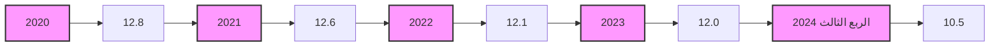
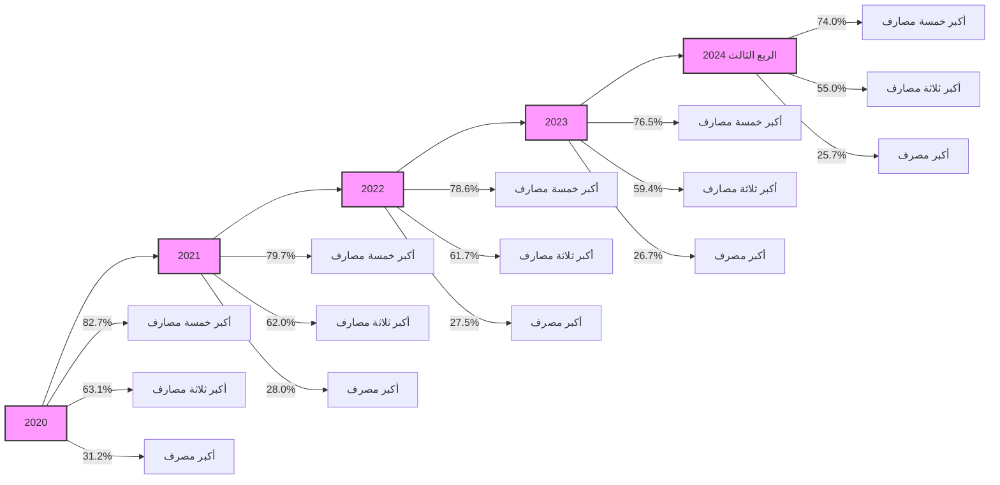
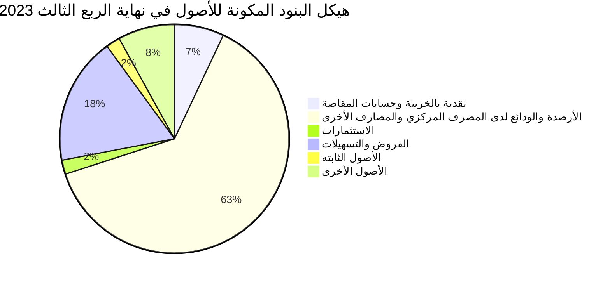
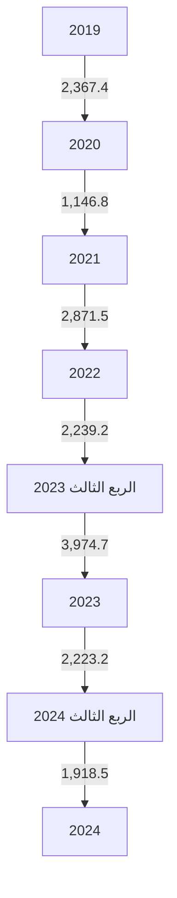
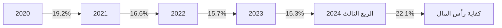
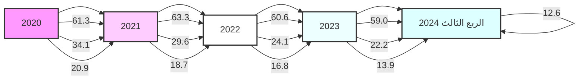
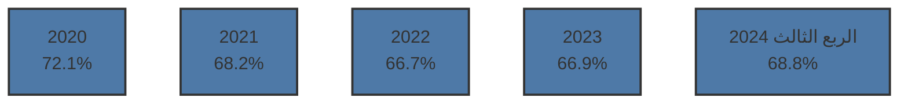
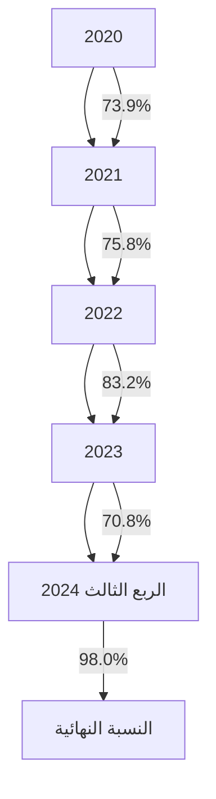

# مصرف ليبيا المركزي
# CENTRAL BANK OF LIBYA

## تقرير
## أهم البيانات والمؤشرات المالية للمصارف
## للربع الثالث 2024

[The image shows a colorful bar graph and line chart representing financial data. The bars are in different colors (blue, yellow, orange, green, red) of varying heights, with a white line graph overlaid, showing an upward trend. The graph is on a partially rolled-up sheet, suggesting ongoing or future data.]

## إدارة البحوث والإحصاء
---
إدارة البحوث والإحصاء

| الصفحة | المحتويات |
|---------|------------|
| 3 | ملخص لأداء المصارف حتى نهاية الربع الثالث 2024 |
| 8 | تفرع المصارف |
| 8 | الكثافة المصرفية |
| 9 | التركز المصرفي |
| 11 | المركز المالي المُجمّع للمصارف |
| 13 | هيكل البنود المكونة للأصول |
| 14 | هيكل البنود المكونة للخصوم |
| 16 | تحليل البنود المكونة للمركز المالي المُجمّع للمصارف |
| 17 | - النقدية بالخزائن وحسابات المقاصة |
| 17 | - الأرصدة والودائع لدى المصرف المركزي والمصارف الأخرى |
| 17 | - الإستثمارات |
| 19 | - القروض والتسهيلات الائتمانية |
| 22 | - ودائع العملاء لدى المصارف |
| 24 | - الحسابات المكشوفة لدى المراسلين بالخارج |
| 25 | - حقوق الملكية |
| 26 | - المخصصات |
| 28 | مؤشرات السلامة المالية للمصارف |
| 28 | - مؤشرات كفاية رأس المال |
| 29 | - مؤشرات جودة الأصول |
| 31 | - مؤشرات الربحية |
| 33 | - مؤشرات السيولة |

صفحة 2 من 36

تقرير أهم البيانات والمؤشرات المالية للمصارف عن الربع الثالث 2024
---
إدارة البحوث والإحصاء

# تقرير أهم البيانات والمؤشرات المالية للمصارف - الربع الثالث 2024

## ملخص لأداء المصارف نهاية الربع الثالث 2024.

شهدت البيانات المالية المُجمّعة للمصارف في نهاية الربع الثالث 2024 بعض التغيرات مقارنة عما كانت عليه
في نهاية نفس الفترة من عام 2023 وذلك على النحو التالي :

- إرتفع إجمالي أصول المصارف (بإستثناء الحسابات النظامية) من 145.2 مليار دينار في نهاية الربع الثالث
2023 إلى نحو 180.2 مليار دينار في نهاية الربع الثالث 2024، بمقدار 34.9 مليار دينار، أي بمعدل نمو
قدره 24.1%، وقد شكلت الأصول السائلة (البالغة 123.9 مليار دينار) من إجمالي الأصول ما نسبته
68.8%.

- إرتفعت أرصدة ودائع المصارف ( تحت الطلب وشهادات الإيداع ) لدى المصرف المركزي بما فيها
الإحتياطي الإلزامي من نحو 77.8 مليار دينار في نهاية الربع الثالث 2023 إلى نحو 108.5 مليار دينار في
نهاية الربع الثالث 2024، بمقدار 30.7 مليار دينار أي بمعدل بلغ 39.4%، وتجدر الإشارة إلى أن
الإحتياطي النقدي الإلزامي المطلوب من المصارف الإحتفاظ به لدى المصرف المركزي نحو 27.7 مليار
دينار.

- إرتفع إجمالي رصيد الإئتمان الممنوح من المصارف من نحو 26.7 مليار دينار في نهاية الربع الثالث 2023
إلى نحو 31.1 مليار دينار في نهاية الربع الثالث 2024 ، بمقدار 4.3 مليار دينار أي بمعدل نمو 16.2%،
هذا الإرتفاع جاء نتيجة توسع المصارف الكبرى (الجمهورية ، الوحدة ، التجاري الوطني، مصرف شمال
أفريقيا ومصرف التجارة والتنمية) في منح التمويلات بصيغ المرابحة المختلفة.

- شكلت القروض والتسهيلات الائتمانية الممنوحة إلى إجمالي الأصول ما نسبته 17.2%، فيما شكلت من
إجمالي الخصوم الإيداعية ما نسبته 22.4%. وبلغ رصيد القروض الممنوحة للقطاع الخاص في نهاية
الربع الثالث 2024 ما قيمته 23.6 مليار دينار، وما نسبته 75.8% من إجمالي القروض والتسهيلات
الإئتمانية الممنوحة، فيما شكل رصيد القروض الممنوحة للقطاع العام النسبة الباقية 24.2% والتي
بلغت قيمتها نحو 7.5 مليار دينار.

صفحة 3 من 36

تقرير أهم البيانات والمؤشرات المالية للمصارف عن الربع الثالث 2024
---
إدارة البحوث والإحصاء

▪ أظهرت بيانات الديون المتعثرة في المصارف أن نسبة الديون المتعثرة إلى إجمالي القروض والتسهيلات الائتمانية بلغت في نهاية الربع الثالث 2024 نحو 21.6%، مسجلة إنخفاضاً عن ماكانت عليه في نهاية عام 2023 والبالغة 22.2%، هذا الإنخفاض جاء نتيجة نمو محفظة الديون بنسبة أكبر من الزيادة في حجم الديون المتعثرة.

▪ بلغـت نسبة تغطية مخصـص الديون المشكـوك فيها لإجمـالي القروض المتعثرة 58.6% في نهاية الربع الثالث 2024، مقابل نسبة 59.0% في نهاية عام 2023.

▪ إرتفعت ودائع العمـلاء (الخصوم الإيداعية) لـدى المصارف بشكل كبير من 110.4 مليار دينـار في نهاية الربع الثالث 2023، إلى 138.5 مليار دينار في نهاية الربع الثالث 2024، بمقدار 28.2 مليار دينار أي بمعدل زيادة قدره 25.5%، وقد شكلت الودائع تحت الطلب ما نسبته 82.4% من إجمالي الودائع، في حين شكلت الودائع لأجل نسبة 17.4% من إجمالي الودائع، بينما شكلت ودائع الإدخار نسبة 0.2% فقط من إجمالي الودائع.

وفيما يتعلق بتوزيع هذه الودائع حسب القطاعين الخاص العام، فقد بلغت ودائع القطاع الخاص لدى المصارف في نهاية الربع الثالث 2024 ما قيمته 83.6 مليار دينار، وما نسبته 60.4% من إجمالي الودائع، فيما شكل رصيد ودائع القطاع العام والحكومي النسبة الباقية وقدرها 39.6% أي ما قيمته 54.9 مليار دينار، منها 42.2 مليار دينار ودائع لشركات ومؤسسات القطاع العام ونحو 12.7 مليار دينار ودائع حكومية.

وتجدر الإشارة إلى أن نحو 66.9% من الخصوم الإيداعية لدى المصارف متركزة في المصارف الأربعة الكبرى: الجمهورية، التجاري الوطني، الوحدة والصحاري.

▪ إرتفع إجمالي حقوق الملكية في المصــارف من 8.9 مليار دينار في نهاية الربع الثالث 2023 إلى 14.1 مليار دينار في نهاية الربع الثالث 2024، وبمعدل 58.7%، نتيجة الزيادة في رأس المال المدفوع لبعض المصارف وفقاً للمتطلبات التي وضعها المصرف المركزي.

▪ إرتفعت أرباح المصارف خلال هذا العام حتى نهاية الربع الثالث 2024 بشكل كبير وبمعدل قياسي بلغ 145.4% لتصل إلى 1,639.4 مليون دينار، مقارنة عما كانت عليه خلال نفس الفترة من عام 2023 والتي سجلت نحو 668.0 مليون دينار.

صفحة 2 من 36
تقرير أهم البيانات والمؤشرات المالية للمصارف عن الربع الثالث 2024
---
إدارة البحوث والإحصاء

- سجلت نسبة هامش الفائدة إلى إجمالي الدخل خلال الربع الثالث 2024 نحو 13.0% ومن المؤكد أنها ستسجل نسبة أعلى في نهاية العام 2024 من النسبة المسجلة في عام 2023 ، هذا التحسن ناتج عن الإيرادات المحققة من العُمولات المُتآتية من خدمات المرابحة ، بالإضافة إلى الفوائد على الأرصدة والودائع لدى المراسلين بالخارج .

- بلغت نسبة المصروفات إلى إجمالي الإيرادات نحو 52.2% خلال الربع الثالث 2024 مقابل نسبة 67.2% خلال نفس الفترة من عام 2023.

- بلغ عدد المصارف والمشتملة بياناتها في هذا التقرير 21 مصرفاً (بما في ذلك وحدة الدينار الليبي التابعة للمصرف الليبي الخارجي) في نهاية الربع الثالث 2024، وتزاول هذه المصارف نشاطها من خلال 672 فرعاً ووكالة.

وفيما يلي تفصيل للتقرير والذي يحتوي على بيانات عن الفروع والكثافة والتركز المصرفي بالإضافة إلى تحليل مفصّل لأهم البنود المكونة للميزانية المُجمعة للمصارف على جانبي الأصول والخصوم وكما يحتوي التقرير على فصل خاص بمؤشرات السلامة المالية 2020 – الربع الثالث 2024 للمصارف.

إدارة البحوث والإحصـــــــــاء

صفحة 5 من 36
تقرير أهم البيانات والمؤشرات المالية للمصارف عن الربع الثالث 2024
---
إدارة البحوث والإحصاء

# البيانات المالية الأساسية للمصارف
"مليون دينار"

| البند | الربع الثالث 2023 | الربع الثالث 2024 | معدل التغير% |
|------|-----------------|-----------------|-------------|
| إجمالي الميزانية ( الأصول + الحسابات النظامية ) | 190,483.1 | 229,330.1 | 20.4 |
| إجمالي الأصول | 145,212.9 | 180,159.0 | 24.1 |
| إجمالي النقدية بخزائن المصارف | 3,974.7 | 1,918.5 | -51.7 |
| إجمالي الودائع لدى المصرف المركزي | 77,848.3 | 108,509.0 | 39.4 |
| إجمالي الودائع لدى المصارف فيما بينها | 550.6 | 694.9 | 26.2 |
| إجمالي الودائع لدى المصرف الليبي الخارجي | 1,039.8 | 927.9 | -10.8 |
| إجمالي الودائع لدى المراسلين بالخارج | 11,266.9 | 11,895.5 | 5.6 |
| إجمالي حسابات المقاصة | 6,354.9 | 4,038.7 | -36.4 |
| إجمالي القروض والسلفيات والتسهيلات | 26,736.3 | 31,061.2 | 16.2 |
| إجمالي الاستثمارات | 2,583.3 | 3,103.3 | 20.1 |
| إجمالي ودائع العملاء | 110,377.5 | 138,538.3 | 25.5 |
| إجمالي الحسابات المكشوفة لدى المراسلين | 181.2 | 944.7 | 421.4 |
| إجمالي حقوق الملكية | 8,854.5 | 14,050.1 | 58.7 |
| إجمالي المخصصات | 9,617.6 | 9,504.9 | -1.2 |
| أرباح العام | 668.0 | 1,639.4 | 145.4 |
| عدد الفروع والوكالات | 645 | 672 | 7.3 |
| عدد العاملين | 20,588 | 21,161 | 2.8 |

## المؤشرات المالية :

| المؤشر | الربع الثالث 2023 | الربع الثالث 2024 |
|--------|-----------------|-----------------|
| الأصول السائلة / إجمالي الأصول % | 65.2 | 68.8 |
| إجمالي القروض / إجمالي الأصول % | 18.4 | 17.2 |
| حقوق الملكية / إجمالي الخصوم % | 6.1 | 7.8 |
| إجمالي الأصول / عدد الفروع ( مليون دينار ) | 225.1 | 268.1 |
| إجمالي الأصول / عدد العاملين ( مليون دينار ) | 7.1 | 8.5 |
| إجمالي القروض / إجمالي الودائع % | 24.2 | 22.4 |
| إجمالي الربح / الأصول % | 0.5 | 0.9 |
| إجمالي الربح / حقوق الملكية % | 7.5 | 11.9 |

صفحة 6 من 36
تقرير أهم البيانات والمؤشرات المالية للمصارف عن الربع الثالث 2024
---
إدارة البحوث والإحصاء

# مؤشرات الودائع لدى المصارف
"مليون دينار"

| البند | الربع الثالث 2023 | الربع الثالث 2024 | معدل التغير% |
|-------|-------------------|-------------------|--------------|
| 1- ودائع الحكومة والقطاع العام | 46,709.8 | 54,883.3 | 17.5 |
| ـ ودائع الحكومة (الوزارات والهيئات الممولة من الميزانية العامة) | 13,169.8 | 12,665.1 | -3.8 |
| ـ ودائع القطاع العام | 33,539.9 | 42,218.2 | 25.9 |
| 2- ودائع القطاع الخاص | 63,667.7 | 83,655.0 | 31.4 |
| ـ ودائع الأفراد | 34,165.4 | 44,751.8 | 31.0 |
| ـ ودائع الشركات والجهات الأخرى | 29,502.3 | 38,903.2 | 31.9 |
| إجمالي الودائع | 110,377.5 | 138,538.3 | 25.5 |
| الودائع تحت الطلب | 88,203.9 | 114,146.4 | 29.4 |
| الودائع لأجل | 21,883.6 | 24,113.6 | 10.2 |
| ودائع الادخار | 290.0 | 278.3 | -4.0 |
| الودائع تحت الطلب / إجمالي الودائع % | 79.9 | 82.4 | - |
| الودائع لأجل / إجمالي الودائع % | 19.8 | 17.4 | - |
| ودائع الادخار / إجمالي الودائع % | 0.3 | 0.2 | - |
| إجمالي الودائع / إجمالي الخصوم % | 76.0 | 76.9 | - |

# مؤشرات الائتمان الممنوح من المصارف
"مليون دينار"

| البند | الربع الثالث 2023 | الربع الثالث 2024 | معدل التغير% |
|-------|-------------------|-------------------|--------------|
| 1- الائتمان الممنوح للقطاع العام | 7,605.5 | 7,502.1 | -1.4 |
| 2- الائتمان الممنوح للقطاع الخاص | 19,130.8 | 23,559.1 | 23.1 |
| إجمالي الائتمان | 26,736.3 | 31,061.2 | 16.2 |
| السلفيات والسحب على المكشوف | 4,205.8 | 3,959.5 | -5.9 |
| قروض المرابحة (تشمل رصيد السلف الإجتماعية) | 10,113.3 | 15,327.5 | 51.6 |
| القروض الممنوحة للأنشطة الاقتصادية الأخرى | 12,417.2 | 11,774.2 | -5.2 |
| قروض المرابحة / إجمالي الائتمان % | 37.8 | 49.3 | - |
| السلفيات والسحب على المكشوف / إجمالي الائتمان % | 15.7 | 12.7 | - |
| القروض الممنوحة للأنشطة الأخرى/اجمالي الائتمان% | 46.4 | 37.9 | - |
| إجمالي الائتمان / إجمالي الأصول % | 18.4 | 17.2 | - |
| إجمالي الائتمان / إجمالي الودائع % | 24.2 | 22.4 | - |

صفحة 7 من 36
تقرير أهم البيانات والمؤشرات المالية للمصارف عن الربع الثالث 2024
---
إدارة البحوث والإحصاء

## تفرع المصارف:

بلغ عدد المصارف العاملة في ليبيا والمشتملة بياناتها في هذا التقرير 21 مصرفاً (بما في ذلك وحدة الدينار الليبي
التابعة للمصرف الليبي الخارجي) حتى نهاية الربع الثالث 2024، وتزاول هذه المصارف نشاطها من خلال 672 فرعاً
ووكالة مصرفية.

## الكثافة المصرفية:

بلغت الكثافة المصرفية خلال الربع الثالث 2024 نحو 12.0 ألف نسمة لكل فرع أو وكالة.

### الكثافة المصرفية
"بالألف نسمة"

| لكل فرع ووكالة | لكل مصرف | نهاية |
|----------------|-----------|-------|
| 12.9 | 368.4 | 2019 |
| 12.8 | 368.3 | 2020 |
| 12.6 | 388.9 | 2021 |
| 12.1 | 350.0 | 2022 |
| 12.0 | 350.0 | 2023 |
| 10.5 | 333.0 | الربع الثالث 2024 |

### الكثافة المصرفية



صفحة 8 من 36
تقرير أهم البيانات والمؤشرات المالية للمصارف عن الربع الثالث 2024
---
إدارة البحوث والإحصاء

# التركز المصرفي:

درجة التركز المصرفي تعني أن عدداً قليلاً من المصارف يستأثر بالنسبة الأكبر من النشاط المصرفي سواءً من حيث الأصول أو الودائع أوالائتمان أو من حيث حجم حقوق الملكية، وفيما يخص الحصة السوقية للمصارف في ليبيا، فقد شكلت أصول المصارف الأربعة الكبرى (الجمهورية، التجاري الوطني، الوحدة والصحاري) من أصل 21 مصرفاً مانسبته 65.6% من إجمالي أصول القطاع المصرفي في نهاية الربع الثالث 2024، وشكل مصرف الجمهورية وحده ما نسبته 25.7% من إجمالي أصول القطاع المصرفي.

وشكلت الخصوم الإيداعية للمصارف الأربعة الكبرى مانسبته 66.9% من إجمالي الخصوم الإيداعية للقطاع المصرفي وفيما شكلت القروض الممنوحة منهم نحو 85.6% من إجمالي القروض الممنوحة من القطاع المصرفي في نهاية الربع الثالث 2024.

ومن خلال بيانات التركز في الجداول والرسومات البيانية أدناه يُلاحظ أن هناك تحسن ملحوظ في نسب تركز الأصول والخصوم الإيداعية ، فيما إرتفعت درجة التركز في الإئتمان كما هو موضح.

## تركز الأصول
"نسب مئوية"

| نهاية | 2020 | 2021 | 2022 | 2023 | الربع الثالث 2024 |
|-------|------|------|------|------|-------------------|
| أكبر مصرف | 31.2 | 28.0 | 27.5 | 26.7 | 25.7 |
| أكبر ثلاثة مصارف | 63.1 | 62.0 | 61.7 | 59.4 | 55.0 |
| أكبر خمسة مصارف | 82.7 | 79.7 | 78.6 | 76.5 | 74.0 |

## تركز الإئتمان
"نسب مئوية"

| نهاية | 2020 | 2021 | 2022 | 2023 | الربع الثالث 2024 |
|-------|------|------|------|------|-------------------|
| أكبر مصرف | 42.6 | 40.7 | 38.6 | 38.9 | 37.7 |
| أكبر ثلاثة مصارف | 78.3 | 76.2 | 74.6 | 76.9 | 77.1 |
| أكبر خمسة مصارف | 91.4 | 87.6 | 85.2 | 89.8 | 90.0 |

صفحة 9 من 36

تقرير أهم البيانات والمؤشرات المالية للمصارف عن الربع الثالث 2024
---
إدارة البحوث والإحصاء

## تركز الخصوم الإيداعية

"نسب مئوية"

| نهاية | 2020 | 2021 | 2022 | 2023 | الربع الثالث 2024 |
|-------|------|------|------|------|------------------|
| أكبر مصرف | 31.8 | 33.8 | 32.1 | 27.9 | 26.9 |
| أكبر ثلاثة مصارف | 62.9 | 62.0 | 60.5 | 59.6 | 55.3 |
| أكبر خمسة مصارف | 83.7 | 79.5 | 79.2 | 77.7 | 76.9 |

### تركز الأصول



### تركز الإئتمان


### تركز الخصوم الإيداعية


صفحة 12 من 36

تقرير أهم البيانات والمؤشرات المالية للمصارف عن الربع الثالث 2024
---
# إدارة البحوث والإحصاء

## المركز المالي المُجمّع للمصارف

شهد المركز المالي المُجمّع للمصارف نهاية الربع الثالث 2024، تطورات في مُجمل بنوده على جانبي الأصول والخصوم، ليبلغ إجمالي أصول المصارف مجتمعة (بإستثناء الحسابات النظامية) نحو 180,159.0 مليون دينار، مقابل 145,212.9 مليون دينار في نهاية الربع الثالث 2023، بإرتفاع قدره 34,946.2 مليون دينار، أي بمعدل 24.1%، وفيما يلي جدول يلخص البنود الرئيسية للمركز المالي المُجمّع للمصارف:

### مُلخص المركز المالي المُجمّع للمصارف

"مليون دينار"

| البند | الربع الثالث 2023 | الربع الثالث 2024 | مقدار التغير | معدل التغير% |
|------|------------------|------------------|--------------|-------------|
| **الأصول:** |
| 1- نقدية بالخزائن | 3,974.7 | 1,918.5 | -2,056.2 | -51.7 |
| - عملة محلية | 3,661.0 | 1,613.9 | -2,047.1 | -55.9 |
| - عملة أجنبية | 313.7 | 304.5 | -9.2 | -2.9 |
| 2- حسابات المقاصة | 6,354.9 | 4,038.7 | -2,316.2 | -36.4 |
| - المقاصة بين المصارف | 3,532.4 | 2,214.7 | -1,317.7 | -37.3 |
| - المقاصة بين الفروع | 2,822.5 | 1,824.0 | -998.5 | -35.4 |
| 3- الودائع لدى المصارف الأخرى | 90,705.6 | 122,027.3 | 31,321.7 | 34.5 |
| أ- الودائع لدى المصرف المركزي | 77,848.3 | 108,509.0 | 30,660.8 | 39.4 |
| - ودائع تحت الطلب | 75,855.7 | 108,509.0 | 32,653.3 | 43.0 |
| - شهادات الإيداع | 1,992.5 | 0.0 | -1,992.5 | -100.0 |
| ب- الودائع لدى المصارف المحلية الأخرى | 550.6 | 694.9 | 144.3 | 26.2 |
| - ودائع تحت الطلب | 550.6 | 694.9 | 144.3 | 26.2 |
| - ودائع زمنية | 0.0 | 0.0 | 0.0 | - |
| ج- الودائع لدى المصرف الليبي الخارجي | 1,039.8 | 927.9 | -112.0 | -10.8 |
| - ودائع تحت الطلب | 746.5 | 927.9 | 181.4 | 24.3 |
| - ودائع زمنية | 293.3 | 0.0 | -293.3 | -100.0 |
| د- الودائع لدى المصارف بالخارج | 11,266.9 | 11,895.5 | 628.6 | 5.6 |
| - ودائع تحت الطلب | 8,072.4 | 8,533.5 | 461.1 | 5.7 |
| - ودائع زمنية | 3,194.5 | 3,362.0 | 167.6 | 5.2 |
| 4- الإستثمارات | 2,583.3 | 3,103.3 | 520.0 | 20.1 |
| 5- القروض والتسهيلات | 26,736.3 | 31,061.2 | 4,324.9 | 16.2 |
| - السلفيات والسحب على المكشوف | 4,205.8 | 3,959.5 | -246.3 | -5.9 |
| - قروض المرابحة للأفراد (تشمل رصيد السلف الاجتماعية) | 10,113.3 | 15,327.5 | 5,214.3 | 51.6 |
| - قروض الأنشطة الإقتصادية الأخرى | 12,417.2 | 11,774.2 | -643.1 | -5.2 |
| 6- الأصول الثابتة | 2,798.7 | 3,726.8 | 928.2 | 33.2 |
| 7- الأصول الأخرى | 12,059.4 | 14,283.2 | 2,223.8 | 18.4 |
| **إجمالي الأصول** | 145,212.9 | 180,159.0 | 34,946.2 | 24.1 |
| الحسابات المقابلة | 45,270.2 | 49,171.1 | 3,900.9 | 8.6 |
| **الإجمالي الكلي للأصول** | 190,483.1 | 229,330.1 | 38,847.0 | 20.4 |

صفحة 11 من 36
تقرير أهم البيانات والمؤشرات المالية للمصارف عن الربع الثالث 2024
---
إدارة البحوث والإحصاء

| البند | الربع الثالث 2023 | الربع الثالث 2024 | مقدار التغير | معدل التغير% |
|-------|-------------------|-------------------|---------------|---------------|
| الخصوم |
| 1- ودائع الغير لدى المصارف | 110,377.5 | 138,538.3 | 28,160.8 | 25.5 |
| - الودائع تحت الطلب | 84,234.6 | 111,420.9 | 27,186.3 | 32.3 |
| - الودائع الزمنية | 2,106.8 | 1,200.7 | -906.0 | -43.0 |
| - الودائع الإدخارية | 290.0 | 278.3 | -11.7 | -4.0 |
| - أوامر الدفع | 3,969.3 | 2,725.5 | -1,243.8 | -31.3 |
| - التأمينات النقدية | 19,776.9 | 22,912.9 | 3,136.1 | 15.9 |
| 2- الإقتراض من المصارف والجهات الأخرى | 31.3 | 30.0 | -1.3 | -4.2 |
| 3- الحسابات المكشوفة لدى المراسلين | 181.2 | 944.7 | 763.5 | 421.4 |
| 4- حقوق الملكية | 8,854.5 | 14,050.1 | 5,195.6 | 58.3 |
| - رأس المال المدفوع | 5,473.5 | 10,653.6 | 5,180.1 | 94.6 |
| - الإحتياطي القانوني | 1,063.2 | 1,276.7 | 213.5 | 20.1 |
| - إحتياطيات غير مخصصة | 395.9 | 180.3 | -215.6 | -54.5 |
| - أرباح العام | 668.0 | 1,639.4 | 971.4 | 145.4 |
| - الأرباح المرحّلة والقابلة للتوزيع | 1,254.0 | 300.2 | -953.8 | -76.1 |
| 5- المخصصات | 9,617.6 | 9,504.9 | -112.8 | -1.2 |
| 6- المتنوعات والخصوم الأخرى | 16,150.8 | 17,091.0 | 940.2 | 5.8 |
| إجمالي الخصوم | 145,212.9 | 180,159.0 | 34,946.2 | 24.1 |
| الحسابات المقابلة | 45,270.2 | 49,171.1 | 3,900.9 | 8.6 |
| الإجمالي الكلي للخصوم | 190,483.1 | 229,330.1 | 38,847.0 | 20.4 |

صفحة 12 من 36
تقرير أهم البيانات والمؤشرات المالية للمصارف عن الربع الثالث 2024
---
# هيكل البنود المكونة للأصول في المركز المالي المُجمّع للمصارف:

استمرت ودائع وأرصدة المصارف لدى المصرف المركزي بما فيها الاحتياطي الإلزامي هي المكوّن الرئيسي لأصول القطاع المصرفي، حيث تغطي نحو 60.2% من إجمالي الأصول في نهاية الربع الثالث 2024، في حين سجلت حصة بند القروض والتسهيلات الائتمانية في هيكل الموجودات نسبة 17.2% من الإجمالي مقارنة بـ 18.4% في نهاية الربع الثالث 2023، بينما بلغت نسبة الاستثمارات فقط 1.7% مما يشير إلى أن الأصول المولّدة للدخل متدنية جدًا ولم تصل حتى إلى 20.0% من إجمالي قاعدة الأصول للقطاع المصرفي وهي مازالت نسب ضئيلة تعكس ضعف توظيف المصارف لأموالها.

## جدول هيكل البنود المكونة للأصول

| البند | الربع الثالث 2023 | الربع الثالث 2024 |
|-------|-------------------|-------------------|
| **الأصول:** | | |
| 1- نقدية بالخزائن | 2.7% | 1.1% |
| 2- حسابات المقاصة | 4.4% | 2.2% |
| 3- الودائع لدى المصرف المركزي | 53.6% | 60.2% |
| 4- الودائع لدى المصارف المحلية الأخرى | 0.4% | 0.4% |
| 5- الودائع لدى المصرف الليبي الخارجي | 0.7% | 0.5% |
| 6- الودائع لدى المصارف بالخارج | 7.8% | 6.6% |
| 7- الاستثمارات | 1.8% | 1.7% |
| 8- القروض والتسهيلات | 18.4% | 17.2% |
| 9- الأصول الثابتة | 1.9% | 2.1% |
| 10- الأصول الأخرى | 8.3% | 7.9% |

## هيكل البنود المكونة للأصول في نهاية الربع الثالث 2023



صفحة 13 من 36
تقرير أهم البيانات والمؤشرات المالية للمصارف عن الربع الثالث 2024
---
إدارة البحوث والإحصاء

| هيكل البنود المكونة للأصول في نهاية الربع الثالث 2024 | حسابات المقاصة | نقدية بالخزينة |
|---------------------------------------------------|----------------|----------------|
| الأصول الأخرى 8% | 2% | 1% |
| الأصول الثابتة 2% | | |
| القروض والتسهيلات 17% | | |
| الإستثمارات 2% | | |
| الأرصدة والودائع لدى المصرف المركزي والمصارف الأخرى 68% | | |

- هيكل البنود المكونة للخصوم في المركز المالي المُجمّع للمصارف:

بتحليل هيكل البنود المكونة للخصوم بالمركز المالي المُجمَع للمصارف في نهاية الربع الثالث 2024، فإن الخصوم الإيداعية لدى المصارف (ودائع العملاء) مازالت تمثل المصدر الرئيسي للتمويل مشكلة مانسبته 76.9% من إجمالي مصادر أموال المصارف، مقارنة بنحو 76.0% في نهاية الربع الثالث 2023، فيما إرتفعت حصة حقوق الملكية إلى نحو 7.8% من إجمالي مصادر أموال المصارف مقارنة بـ 6.1% في نهاية الربع الثالث 2023.

جدول هيكل البنود المكونة للخصوم

| البند | الربع الثالث 2023 | الربع الثالث 2024 |
|-------|-------------------|-------------------|
| الخصوم | | |
| 1- ودائع الغير لدى المصارف | 76.0% | 76.9% |
| 2-الإقتراض من المصارف | 0.0% | 0.0% |
| 3-الحسابات المكشوفة لدى المراسلين | 0.1% | 0.5% |
| 4-حقوق الملكية | 6.1% | 7.8% |
| 5-المخصصات | 6.6% | 5.3% |
| 6-المتنوعات والخصوم الأخرى | 11.1% | 9.5% |

صفحة 14 من 36
تقرير أهم البيانات والمؤشرات المالية للمصارف عن الربع الثالث 2024
---
إدارة البحوث والإحصاء

| هيكل البنود المكونة للخصوم في نهاية الربع الثالث 2023 |
|:------------------------------------------------:|
| المتنوعات والخصوم الأخرى 11% |
| المخصصات 7% |
| حقوق الملكية 6% |
| الحسابات المكشوفة لدى المراسلين 0% |
| الإقتراض من المصارف 0% |
| ودائع الغير لدى المصارف 76% |

| هيكل البنود المكونة للخصوم في نهاية الربع الثالث 2024 |
|:------------------------------------------------:|
| المتنوعات والخصوم الأخرى 10% |
| المخصصات 5% |
| حقوق الملكية 8% |
| الحسابات المكشوفة لدى المراسلين -1% |
| الإقتراض من المصارف 0% |
| ودائع الغير لدى المصارف 77% |

صفحة 15 من 36
تقرير أهم البيانات والمؤشرات المالية للمصارف عن الربع الثالث 2024
---
إدارة البحوث والإحصاء

# تحليل لأهم البنود المكونة للمركز المالي المجمع للمصارف

## أولاً: جانب الأصول

### 1- النقدية :

#### أ- النقدية بالخزائن وحسابات المقاصة :

إنخفض رصيد النقدية وحسابات المقاصة بمقدار 4,372.4 مليون دينار أي بمعدل 42.3%، ليصل إلى 5,957.2 مليون دينار في نهاية الربع الثالث 2024، مقابل 10,329.6 مليون دينار في نهاية الربع الثالث 2023، بسبب الإنخفاض في رصيد حسابات المقاصة بمقدار 2,316.2 مليون دينار مقارنة بنفس الفترة من عام 2023.

وكذلك الإنخفاض في رصيد النقدية بالخزائن بمقدار 2,056.2 مليون دينار، والجدول التالي يوضح التغيرات في بند النقدية بخزائن المصارف وحسابات المقاصة :

| البيان | الربع الثالث 2023 | الربع الثالث 2024 | مقدار التغير | معدل التغير% |
|--------|-------------------|-------------------|---------------|---------------|
| النقدية بالخزائن : | 3,974.7 | 1,918.5 | -2,056.2 | -51.7 |
| عملة محلية | 3,661.0 | 1,613.9 | -2,047.1 | -55.9 |
| عملة أجنبية | 313.7 | 304.5 | -9.2 | -2.9 |
| إجمالي حسابات المقاصة | 6,354.9 | 4,038.7 | -2,316.2 | -36.4 |
| المقاصة بين المصارف | 3,532.4 | 2,214.7 | -1,317.7 | -37.3 |
| المقاصة بين الفروع | 2,822.5 | 1,824.0 | -998.5 | -35.4 |
| الإجمالي | 10,329.6 | 5,957.2 | -4,372.4 | -42.3 |

نقدية بخزائن المصارف



صفحة 16 من 36
تقرير أهم البيانات والمؤشرات المالية للمصارف عن الربع الثالث 2024
---
إدارة البحوث والإحصاء

## إجمالي حسابات المقاصة

| السنة | القيمة (مليون دينار) |
|-------|----------------------|
| 2019 | 6,304.6 |
| 2020 | 5,584.8 |
| 2021 | 6,041.0 |
| 2022 | 7,034.7 |
| الربع الثالث 2023 | 7,337.1 |
| 2023 | 6,354.9 |
| الربع الثالث 2024 | 4,038.7 |

## ب- الأرصدة والودائع لدى المصرف المركزي والمصارف الأخرى:

بلغ رصيد ودائع وأرصدة المصارف لدى المصرف المركزي والمصارف المحلية الأخرى ولدى المصارف الخارجية نحو 122,027.3 مليون دينار في نهاية الربع الثالث 2024، مقابل 90,705.6 مليون دينار في نهاية الربع الثالث 2023، مرتفعة بشكل كبير بقيمة 31,321.7 مليون دينار بمعدل 34.5%، هذا الارتفاع جاء نتيجة إرتفاع الأرصدة والودائع تحت الطلب لدى المصرف المركزي بمقدار 32,653.3 مليون دينار، كذلك إرتفعت ودائع المصارف لدى المصارف المراسلة بالخارج وكذلك ودائع المصارف فيما بينها، فيما إنخفضت ودائع المصارف لدى المصرف الليبي الخارجي، كما موضح بالجدول التالي:

### الأرصدة والودائع لدى المصرف المركزي والمصارف الأخرى

"مليون دينار"

| البند | الربع الثالث 2023 | الربع الثالث 2024 | مقدار التغير | معدل التغير% |
|-------|-------------------|-------------------|---------------|--------------|
| ودائع تحت الطلب لدى: | 85,225.2 | 118,665.3 | 33,440.0 | 39.2 |
| المصرف المركزي | 75,855.7 | 108,509.0 | 32,653.3 | 43.0 |
| المصارف المحلية | 550.6 | 694.9 | 144.3 | 26.2 |
| المصرف الليبي الخارجي | 746.5 | 927.9 | 181.4 | 24.3 |
| لدى المراسلين بالخارج | 8,072.4 | 8,533.5 | 461.1 | 5.7 |
| ودائع زمنية: | 5,480.4 | 3,362.0 | -2,118.3 | -38.7 |
| المصرف المركزي (شهادات الإيداع) | 1,992.5 | 0.0 | -1,992.5 | -100.0 |
| المصارف المحلية | 0.0 | 0.0 | 0.0 | - |
| المصرف الليبي الخارجي | 293.3 | 0.0 | -293.3 | -100.0 |
| لدى المراسلين بالخارج | 3,194.5 | 3,362.0 | 167.6 | 5.2 |
| الإجمالي | 90,705.6 | 122,027.3 | 31,321.7 | 34.5 |

صفحة 17 من 36
تقرير أهم البيانات والمؤشرات المالية للمصارف عن الربع الثالث 2024
---
إدارة البحوث والإحصاء

## ودائع المصارف التجارية لدى المصرف المركزي والمصارف الأخرى

| السنة | الودائع تحت الطلب | الودائع الزمنية | الإجمالي |
|-------|-------------------|-----------------|----------|
| 2019 | 60,184.6 | 17,240.3 | 77,424.9 |
| 2020 | 72,269.0 | 17,567.6 | 89,836.6 |
| 2021 | 74,216.6 | 15,700.2 | 89,916.8 |
| 2022 | 90,839.6 | 6,054.7 | 96,894.4 |
| الربع الثالث 2023 | 85,225.2 | 5,480.4 | 90,705.6 |
| 2023 | 97,057.6 | 6,957.9 | 104,015.5 |
| الربع الثالث 2024 | 118,665.3 | 3,362.0 | 122,027.3 |

## 2- الإستثمارات :

سجل إجمالي رصيد إستثمارات المصارف في الشركات العامة والخاصة المساهمة والإستثمارات الأخرى نهاية الربع الثالث 2024 نحو 3,103.3 مليون دينار، مقابل 2,583.3 مليون دينار في نهاية الربع الثالث 2023، مرتفعة بمقدار 520.0 مليون دينار. هذا الإرتفاع جاء نتيجة للزيادة في بند الإستثمارات في الشركات الخاصة المساهمة وكذلك الإستثمارات الأخرى، والجدول التالي يوضح تفاصيل هذا البند:

### بند الإستثمارات

| البيان | الربع الثالث 2023 | الربع الثالث 2024 | مقدار التغير | معدل التغير% |
|--------|-------------------|-------------------|---------------|---------------|
| سندات وأذونات الخزانة | 0.0 | 0.0 | 0.0 | - |
| إستثمارات في الشركات العامة | 568.6 | 569.9 | 1.4 | 0.2 |
| إستثمارات في الشركات الخاصة المساهمة | 1,131.7 | 1,393.5 | 261.8 | 23.1 |
| إستثمارات أخرى | 883.0 | 1,139.9 | 256.8 | 29.1 |
| الإجمالي | 2,583.3 | 3,103.3 | 520.0 | 20.1 |

صفحة 18 من 36
تقرير أهم البيانات والمؤشرات المالية للمصارف عن الربع الثالث 2024
---

| إجمالي بند الإستثمارات |
|------------------------|
| 6,000.0                |
| 4,000.0                |
| 2,000.0                |
| 0.0                    |


---
إدارة البحوث والإحصاء

## رصيد بند المرابحة والسلف الإجتماعية

| السنة | القيمة (مليون دينار) |
|-------|----------------------|
| 2019 | 3,125.5 |
| 2020 | 3,036.5 |
| 2021 | 4,819.3 |
| 2022 | 7,015.4 |
| الربع الثالث 2023 | 10,113.3 |
| 2023 | 12,700.2 |
| الربع الثالث 2024 | 15,327.5 |

## السلفيات والسحب على المكشوف

| السنة | القيمة (مليون دينار) |
|-------|----------------------|
| 2019 | 5,275.4 |
| 2020 | 4,495.7 |
| 2021 | 4,618.6 |
| 2022 | 4,166.2 |
| الربع الثالث 2023 | 4,205.8 |
| 2023 | 4,023.7 |
| الربع الثالث 2024 | 3,959.5 |

## توزيع القروض الممنوحة من المصارف حسب القطاع (خاص وعام)

"مليون دينار"

| البند | الربع الثالث 2023 | الربع الثالث 2024 | مقدار التغير | معدل التغير% |
|-------|-------------------|-------------------|---------------|--------------|
| القروض الممنوحة للقطاع العام | 7,605.5 | 7,502.1 | -103.4 | -1.4 |
| القروض الممنوحة للقطاع الخاص | 19,130.8 | 23,559.1 | 4,428.3 | 23.1 |
| الإجمالي | 26,736.3 | 31,061.2 | 4,324.9 | 16.2 |

صفحة 20 من 36
تقرير أهم البيانات والمؤشرات المالية للمصارف عن الربع الثالث 2024
---
إدارة البحوث والإحصاء

## رصيد القروض الممنوحة للقطاع العام

| السنة | القيمة (مليون دينار) |
|-------|----------------------|
| 2019 | 6,057.0 |
| 2020 | 5,918.2 |
| 2021 | 6,471.7 |
| 2022 | 6,243.8 |
| الربع الثالث 2023 | 7,605.5 |
| 2023 | 6,525.6 |
| الربع الثالث 2024 | 7,502.1 |

## رصيد القروض الممنوحة للقطاع الخاص

| السنة | القيمة (مليون دينار) |
|-------|----------------------|
| 2019 | 10,855.8 |
| 2020 | 11,078.7 |
| 2021 | 13,165.8 |
| 2022 | 16,727.2 |
| الربع الثالث 2023 | 19,130.8 |
| 2023 | 21,984.8 |
| الربع الثالث 2024 | 23,559.1 |

صفحة 21 من 36

تقرير أهم البيانات والمؤشرات المالية للمصارف عن الربع الثالث 2024
---
إدارة البحوث والإحصاء

## ثانياً: جانب الخصوم

### 1- ودائع العملاء لدى المصارف :

ارتفعت الخصوم الإيداعية (ودائع العملاء) لدى المصارف بشكل كبير بمقدار 28,160.8 مليون دينار من
110,377.5 مليون دينار في نهاية الربع الثالث 2023، إلى 138,538.3 مليون دينار في نهاية الربع الثالث 2024 ،
أي بمعدل نمو بلغ 25.5%، وقد شكلت الودائع تحت الطلب وأوامر الدفع ما نسبته 82.4% من إجمالي
الودائع، في حين شكلت الودائع لأجل والتأمينات النقدية نسبة 17.4% من إجمالي الودائع، بينما شكلت ودائع
الادخار نسبة 0.2% فقط من إجمالي الودائع.

#### جدول الخصوم الإيداعية (ودائع العملاء)
" مليون دينار "

| البند | الربع الثالث 2023 | الربع الثالث 2024 | مقدار التغير | معدل التغير% |
|---|---|---|---|---|
| الودائع تحت الطلب | 84,234.6 | 111,420.9 | 27,186.3 | 32.3 |
| الودائع لأجل | 2,106.8 | 1,200.7 | -906.0 | -43.0 |
| الودائع الإدخارية | 290.0 | 278.3 | -11.7 | -4.0 |
| أوامر الدفع | 3,969.3 | 2,725.5 | -1,243.8 | -31.3 |
| التأمينات النقدية | 19,776.9 | 22,912.9 | 3,136.1 | 15.9 |
| الإجمالي | 110,377.5 | 138,538.3 | 28,160.8 | 25.5 |

- الودائع تحت الطلب وأوامر الدفع : ارتفعت الودائع تحت الطلب وأوامر الدفع بشكل كبير في نهاية
الربع الثالث 2024 بمقدار 25,942.5 مليون دينار لتسجل 114,146.4 مليون دينار مقارنة بـ
88,203.9 مليون دينار في نهاية نفس الفترة من العام 2023.

- الودائع لأجل والتأمينات النقدية : ارتفع بند الودائع لأجل والتأمينات النقدية في نهاية الربع الثالث
2024 بمقدار 2,230.0 مليون دينار لتسجل 24,113.6 مليون دينار مقابل 21,883.6 مليون دينار في
نهاية الربع الثالث 2023. وتجدر الإشارة إلى أن معظم التأمينات النقدية هي مقابل الاعتمادات
المستندية.

- الودائع الإدخارية : إنخفض رصيد الودائع الإدخارية في نهاية الربع الثالث 2024 بمقدار 11.7 مليون
دينار لتسجل 278.3 مليون دينار مقابل 290.0 مليون دينار في نهاية نفس الفترة من العام 2023.

صفحة 22 من 36
تقرير أهم البيانات والمؤشرات المالية للمصارف عن الربع الثالث 2024
---
إدارة البحوث والإحصاء

## إجمالي ودائع العملاء لدى المصارف

```
                138,538.3
150,000.0                                                   125,943.9
            102,194.2          102,052.7    110,377.5
100,000.0   88,600.0           92,113.7
           77,600.0           73,103.0    83,425.0                    114,146.4
                    92,530.6                            102,484.5
 مليون دينار50,000.0                               88,203.9
             10,600.0   9,225.9    18,695.6   18,317.3
                 400.0     437.6      315.1      310.4  21,883.6290.0 23,176.8282.6 24,113.6278.3
      0.0
              2019       2020       2021       2022    الربع الثالث    2023    الربع الثالث
                                                         2023                    2024
            ودائع تحت الطلب        ودائع زمنية        ودائع إدخارية         إجمالي الودائع
```

وفيما يتعلق بتوزيع ودائع العملاء لدى المصارف حسب القطاع (حكومي، عام، خاص):

فقد إرتفعت ودائع القطاع العام والحكومي في نهاية الربع الثالث 2024 بمقدار 8,173.5 مليون دينار لتصل إلى 54,883.3 مليون دينار، منها 12,665.1 مليون دينار كودائع حكومية والتي تتكون من ودائع الوزارات والهيئات والمؤسسات الحكومية وودائع كل من: صندوق الضمان الإجتماعي، صندوق الإنماء الإقتصادي والإجتماعي وودائع الصندوق الليبي للتنمية والإستثمار، مقابل 46,709.8 مليون دينار كودائع للقطاع العام والحكومي في نهاية الربع الثالث 2023.

أما فيما يتعلق بودائع القطاع الخاص لدى المصارف فقد أرتفعت بشكل أكبر في نهاية الربع الثالث 2024 بمقدار 19,987.3 مليون دينار وبنسبة 31.4% لتسجل نحو 83,655.0 مليون دينار مقارنة بنحو 63,667.7 مليون دينار عما كانت عليه في نهاية نفس الفترة من العام 2023.

### جدول توزيع ودائع العملاء لدى المصارف حسب القطاع (حكومي، عام، خاص)

"مليون دينار"

| البند | الربع الثالث 2023 | الربع الثالث 2024 | مقدار التغير | معدل التغير% |
|-------|-------------------|-------------------|---------------|--------------|
| ودائع الحكومة والقطاع العام | 46,709.8 | 54,883.3 | 8,173.5 | 17.5 |
| - ودائع حكومية | 13,169.8 | 12,665.1 | -504.8 | -3.8 |
| - ودائع القطاع العام | 33,539.9 | 42,218.2 | 8,678.3 | 25.9 |
| ودائع القطاع الخاص | 63,667.7 | 83,655.0 | 19,987.3 | 31.4 |
| - الأفراد | 34,165.4 | 44,751.8 | 10,586.4 | 31.0 |
| - الشركات والمؤسسات | 29,502.3 | 38,903.2 | 9,400.9 | 31.9 |
| الإجمالي | 110,377.5 | 138,538.3 | 28,160.8 | 25.5 |

صفحة 23 من 36
تقرير أهم البيانات والمؤشرات المالية للمصارف عن الربع الثالث 2024
---
إدارة البحوث والإحصاء

## ودائع القطاع الحكومي والقطاع العام

| السنة | ودائع حكومية | ودائع القطاع العام |
|-------|---------------|---------------------|
| 2019 | 11,694.6 | 30,648.5 |
| 2020 | 12,093.5 | 29,527.2 |
| 2021 | 11,533.8 | 25,277.9 |
| 2022 | 12,182.2 | 31,094.8 |
| الربع الثالث 2023 | 13,169.8 | 33,539.9 |
| 2023 | 11,702.8 | 42,367.1 |
| الربع الثالث 2024 | 12,665.1 | 42,218.2 |

## ودائع القطاع الخاص

| السنة | الأفراد | الشركات والمؤسسات |
|-------|---------|---------------------|
| 2019 | 27,402.6 | 19,208.4 |
| 2020 | 38,908.5 | 21,665.0 |
| 2021 | 29,161.3 | 26,140.7 |
| 2022 | 32,922.4 | 25,853.4 |
| الربع الثالث 2023 | 34,165.4 | 29,502.3 |
| 2023 | 39,275.7 | 32,598.4 |
| الربع الثالث 2024 | 44,751.8 | 38,903.2 |

## الحسابات المكشوفة لدى المراسلين بالخارج: -2

بلغ رصيد الحسابات المكشوفة لدى المراسلين بالخارج 944.7 مليون دينار في نهاية الربع الثالث 2024، مرتفعة عما كانت عليه في نهاية نفس الفترة من العام 2023، وهذه الحسابات المكشوفة للمصارف بالخارج ناتجة فقط عن تأخر بعض المصارف في تسوية حساباتها مع المصارف المراسلة.

### جدول الحسابات المكشوفة لدى المراسلين بالخارج

"مليون دينار"

| البيان | الربع الثالث 2023 | الربع الثالث 2024 | مقدار التغير | معدل التغير% |
|--------|-------------------|-------------------|---------------|---------------|
| الحسابات المكشوفة لدى المراسلين بالخارج | 181.2 | 944.7 | 763.5 | 421.4 |

صفحة 24 من 36
تقرير أهم البيانات والمؤشرات المالية للمصارف عن الربع الثالث 2024
---
إدارة البحوث والإحصاء

| الحسابات المكشوفة لدى المراسلين بالخارج |       |       |       |       |       |       |       |       |
|------------------------------------------|-------|-------|-------|-------|-------|-------|-------|-------|
| 1000.0                                   |       |       |       |       |       |       |       | 944.7 |
| 800.0                                    |       |       |       |       |       |       |       |       |
| 600.0                                    |       |       |       |       |       |       |       |       |
| 400.0                                    |       | 220.4 |       |       | 181.2 |       |       |       |
| 200.0                                    | 113.1 |       | 144.7 | 102.9 |       |       | 30.3  |       |
| 0.0                                      |       |       |       |       |       |       |       |       |
|                                          | 2019  | 2020  | 2021  | 2022  | الربع الثالث 2023 | 2023 | الربع الثالث 2024 |

### 3- حقوق الملكية :

ارتفع رصيد حقوق الملكية في المصارف من 8,854.5 مليون دينار في نهاية الربع الثالث 2023، ليصل إلى 14,050.1 مليون دينار في نهاية الربع الثالث 2024، نتيجة الزيادة في رأس المال المدفوع لبعض المصارف وكذلك الاحتياطيات القانونية، فيما سجلت أرباح المصارف خلال التسعة أشهر الأولى من هذا العام 2024 ارتفاعاً قياسياً بمعدل 145.4% لتسجل نحو 1,639.4 مليون دينار، مقارنة عما كانت عليه خلال نفس الفترة من العام الماضي 2023 والبالغة نحو 668.0 مليون دينار. هذا الارتفاع في الأرباح جاء نتيجة ارتفاع الإيرادات التي حققتها المصارف بنسبة أعلى من ارتفاع مصروفاتها.

### حسابات رأس المال
" مليون دينار "

| البيان                                | الربع الثالث 2023 | الربع الثالث 2024 | مقدار التغير | معدل التغير% |
|---------------------------------------|-------------------|-------------------|---------------|--------------|
| رأس المال المدفوع                     | 5,473.5           | 10,653.6          | 5,180.1       | 94.6         |
| الاحتياطي القانوني                    | 1,063.2           | 1,276.7           | 213.5         | 20.1         |
| احتياطيات غير مخصصة                   | 395.9             | 180.3             | -215.6        | -54.5        |
| أرباح العام                           | 668.0             | 1,639.4           | 971.4         | 145.4        |
| الأرباح المرحّلة والأرباح القابلة للتوزيع | 1,254.0           | 300.2             | -953.8        | -76.1        |
| الإجمالي                              | 8,854.5           | 14,050.1          | 5,195.6       | 58.7         |

صفحة 25 من 36
تقرير أهم البيانات والمؤشرات المالية للمصارف عن الربع الثالث 2024
---
إدارة البحوث والإحصاء

## إجمالي حقوق الملكية في المصارف

| السنة | رأس المال | الإحتياطيات | إجمالي حقوق الملكية |
|-------|-----------|-------------|---------------------|
| 2019 | 4,282.9 | 2,693.9 | 6,976.8 |
| 2020 | 4,295.9 | 2,550.4 | 6,846.3 |
| 2021 | 4,696.6 | 2,830.1 | 7,526.7 |
| 2022 | 5,295.2 | 3,343.5 | 8,638.7 |
| الربع الثالث 2023 | 5,473.5 | 3,381.0 | 8,854.5 |
| 2023 | 5,778.7 | 3,158.3 | 8,937.0 |
| الربع الثالث 2024 | 10,653.6 | 3,396.6 | 14,050.1 |

*القيم بالمليون دينار*

## أرباح المصارف

| السنة | الأرباح (مليون دينار) |
|-------|------------------------|
| 2019 | 867.7 |
| 2020 | 608.7 |
| 2021 | 1,176.9 |
| 2022 | 830.5 |
| 2023 | 1,048.1 |
| حتى نهاية الربع الثالث 2024 | 1,639.4 |

## المخصصات:

سجل رصيد المخصصات إنخفاضاً بمقدار 112.8 مليون دينار في نهاية الربع الثالث 2024 ليصل إلى 9,504.9 مليون دينار، مقابل 9,617.6 مليون دينار في نهاية نفس الفترة من عام 2023، وتركز الإنخفاض في بند مخصص تقييم أسعار الصرف، في حين سجل رصيد بنود مخصص الديون المشكوك في تحصيلها و مخصص إستهلاك الأصول الثابتة و المخصصات العامة إرتفاعاً مقارنة بما كان عليه في نفس الفترة من العام الماضي كما هو موضح بالجدول التالي:

صفحة 26 من 36
تقرير أهم البيانات والمؤشرات المالية للمصارف عن الربع الثالث 2024
---
إإدإرة إلبحوث وإلإحصاء


                                                                   جدول املخصصــــــــــــــات
                           ”مليون دينار"
           معدل التغير%               مقدارالتغير              الربع الثالث              الثالثالربع                                 البند
                                                                   0202                      0203
                 13.3                    527.2                   4,493.5                   3,966.3                مخصص الديون املشكوك في تحصيلها
                 13.3                    146.9                   1,253.5                   1,106.6                   مخصص إستهالك األصول الثابتة
                  2.0                     28.8                   1,445.2                   1,416.4                            مخصصات عامة
                -26.1                   -815.7                   2,312.7                   3,128.3                    مخصص تقييم أسعار الصرف
                 -1.2                   -112.8                   9,504.9                   9,617.6                                اإلجمالي


                                                                  بند املخصصات
                5,000.0                                                                               4,493.5
                4,500.0               3,966.3
                4,000.0
                3,500.0                                                 3,128.3
                3,000.0
                2,500.0                                                                                                                 2,312.7
             مليون دينار2,000.0                              1,416.4                                                         1,445.2
                1,500.0                          1,106.6                                                         1,253.5
                1,000.0
                  500.0
                     0.0
                                                   2023الربع الثالث                                                2024الربع الثالث


                    مخصص الديون املشكوك في تحصيلها             مخصص إستهالك الصول الثابتة            مخصصات عامة            مخصص تقييم أسعارالصرف


                                                                           36من07صفحة
0202انات واملؤشرات املالية للمصارف عن الربع الثالثتقريرأهم البي
---
إدارة البحوث والإحصاء

# مؤشـــــــرات السلامة المالية للمصـــارف

تعتبر مؤشرات السلامة المالية مقياس لصحة القطاع المالي ووحداته المؤسسية بصفة عامة وللقطاع المصرفي بصفة خاصة، وهى إحدى المدخلات المهمة في تحليل وتقييم السلامة الإحترازية الكلية، حيث يتناول هذا الفصل تحليل مؤشرات السلامة المالية للقطاع المصرفي الليبي خلال الفترة (2020 – الربع الثالث 2024).

## 1- مؤشرات رأس المال:

### جدول مؤشرات رأس المال

| المؤشر | 2020 | 2021 | 2022 | 2023 | الربع الثالث 2024 |
|--------|------|------|------|------|-------------------|
| معدل كفاية رأس المال الكلي% | 19.2 | 16.6 | 15.7 | 15.3 | 22.1 |
| معدل كفاية رأس المال الأساسي% | 17.9 | 15.3 | 14.3 | 13.6 | 20.8 |
| راس المال المدفوع / إجمالي الأصول% | 3.6 | 3.5 | 3.5 | 3.9 | 5.9 |
| حقوق الملكية / إجمالي الأصول% | 4.9 | 4.7 | 5.2 | 6.1 | 7.8 |
| حقوق الملكية / إجمالي الودائع% | 6.1 | 6.9 | 7.6 | 7.0 | 10.1 |

### - كفاية رأس المال:

إرتفعت نسبة كفاية رأس المال إلى 22.1% في الربع الثالث 2024 مقارنة بنسبة 15.3% في نهاية 2023، جاء الإرتفاع نتيجة زيادة في رأس المال المدفوع للمصارف، وتجدر الإشارة أنه خلال الفترة (2020 – الربع الثالث 2024) كانت نسبة كفاية رأس المال أعلى من النسبة المعمول بها والمحددة من قبل المصرف المركزي والمتوافقة مع متطلبات لجنة بازل (1) والبالغة 8.0%.

وتجدرالإشارة إلى أن إدارة الرقابة على المصارف والنقد قد أعتمدت تطبيق أفضل الممارسات الدولية الخاصة بالمتطلبات الصادرة عن لجنة بازل (2) للرقابة المصرفية، وقد أصدرت عدة مناشير بهذا الخصوص منها المنشورين رقمي (11و13) 2022 بشأن تعليمات إحتساب ملاءة رأس المال.



صفحة 28 من 36
تقرير أهم البيانات والمؤشرات المالية للمصارف عن الربع الثالث 2024
---
إدارة البحوث والإحصاء

- رأس المال إلى إجمالي الأصول:

نسبة رأس المال إلى إجمالي الأصول وهى أحدى المؤشرات الأساسية للسلامة المالية والتي تقيس الرفع المالي (أي نسبة تمويل الأصول بموارد غير مواردها الذاتية) ، ووفقاً لمتطلبات لجنة بازل يجب أن لاتقل هذه النسبة عن 3%، وبشكل عام فقد سجلت المصارف نسب للرفع المالي أعلى من النسبة المشار إليها وفقاً لمتطلبات بازل، حيث سجلت نسب 3.6، 3.5، 3.5، 3.9، 5.9 على التوالي خلال الفترة (2020 – الربع الثالث 2024).

| رأس المال إلى إجمالي الأصول |     |     |     |     |     |
|---------------------------|-----|-----|-----|-----|-----|
| 7.0                       |     |     |     |     | 5.9 |
| 6.0                       |     |     |     |     |     |
| 5.0                       | 3.6 |     |     | 3.9 |     |
| 4.0                       |     | 3.5 | 3.5 |     |     |
| % 3.0                     |     |     |     |     |     |
| 2.0                       |     |     |     |     |     |
| 1.0                       |     |     |     |     |     |
| 0.0                       |     |     |     |     |     |
|                           | 2020| 2021| 2022| 2023| الربع الثالث 2024 |

-2 مؤشرات جودة الأصول:

بتحليل هيكل البنود المكونة للأصول في نهاية الربع الثالث 2024، يلاحظ إستمرار تدني نسبة القروض والتسهيلات إلى إجمالي الأصول والتي شكلت نحو 17.2%، بينما بلغت نسبة الأستثمارات فقط 1.7% مما يشير إلى أن الأصول المُولّدة للدخل متدنية جداً ولم تصل حتى إلى 20.0% من إجمالي قاعدة الأصول للقطاع المصرفي، في المقابل شكلت النقدية بخزائن المصارف والأرصدة لدى المصرف المركزي نحو 61.3% من إجمالي قاعدة الأصول للقطاع المصرفي مما يعكس ضعف توظيف المصارف لأموالها، وفيما يلي أهم مؤشرات جودة الأصول:

- القروض المتعثرة إلى إجمالي القروض:

أظهرت بيانات الديون المتعثرة في المصارف أن نسبة الديون المتعثرة إلى إجمالي القروض والتسهيلات الإئتمانية الممنوحة بلغت في نهاية الربع الثالث 2024 نحو 21.6%، مسجلة إنخفاضاً عما كانت عليه في نهاية عام 2023

صفحة 29 من 36
تقرير أهم البيانات والمؤشرات المالية للمصارف عن الربع الثالث 2024
---
إدارة البحوث والإحصاء

والبالغة 22.2%، هذا الانخفاض جاء نتيجة نمو محفظة الديون بنسبة أكبر من الزيادة في حجم الديون
المتعثرة ، حيث إرتفع رصيد محفظة الديون بنسبة 9% مقابل نمو حجم الديون المتعثرة بنسبة 4%.

مازال الأمر الذي يحتاج من بعض المصارف متابعة محافظها الائتمانية و زيادة كفاءة إدارات الائتمان بها،
ووفقاً للمعايير الدولية ينبغي أن لا تتجاوز نسبة القروض المتعثرة إلى إجمالي القروض نسبة 5%.

- نسبة تغطية مخصص الديون إلى القروض المتعثرة :

فيما يخص نسبة تغطية مخصص الديون إلى القروض المتعثرة فقد سجلت في نهاية الربع الثالث 2024 نحو
58.6% مقابل نسبة 59.0% في نهاية عام 2023 ، وخلال السنوات (2019 -2022) فقد سجلت مخصصات
التغطية نسب في حدود 60% على مستوى القطاع ، أما بتحليل هذه النسب وفق المصارف فقد سجلت بعض
المصارف الهامة نسب متدنية، وعليها إتخاذ إجراءات إحترازية من خلال زيادة مخصصات الديون المتعثرة
للوصول إلى نسب ملائمة لمواجهة أي خسائر متوقعة.

## جدول مؤشرات جودة الأصول

| المؤشر | 2020 | 2021 | 2022 | 2023 | الربع الثالث 2024 |
|---|---|---|---|---|---|
| القروض المتعثرة / إجمالي الأصول% | 4.6 | 4.3 | 3.8 | 3.9 | 3.7 |
| القروض المتعثرة/ إجمالي القروض% | 34.1 | 29.6 | 24.1 | 22.2 | 21.6 |
| مخصص الديون / إجمالي القروض المتعثرة% | 61.3 | 63.3 | 60.6 | 59.0 | 58.6 |
| مخصص الديون / إجمالي القروض% | 20.9 | 18.7 | 16.8 | 13.9 | 12.6 |

## مؤشرات جودة الأصول



مخصص الديون /إجمالي القروض المتعثرة%
القروض المتعثرة/ إجمالي القروض%
مخصص الديون / إجمالي القروض%

صفحة 32 من 36
تقرير أهم البيانات والمؤشرات المالية للمصارف عن الربع الثالث 2024
---
إدارة البحوث والإحصاء

### -3 مؤشرات الربحية :

#### جدول مؤشرات الربحية

| المؤشر | 2020 | 2021 | 2022 | 2023 | الربع الثالث 2024 |
|--------|------|------|------|------|------------------|
| العائد / الأصول% | 0.5 | 0.9 | 0.6 | 0.7 | 1.2 |
| العائد / حقوق الملكية% | 9.8 | 18.5 | 10.7 | 12.4 | 15.6 |
| العائد/ الودائع% | 0.6 | 1.3 | 0.8 | 0.9 | 1.6 |
| نسبة هامش الفائدة إلى إجمالي الدخل % | 17.8 | 12.1 | 12.3 | 15.9 | 13.0 |
| نسبة المصروفات بخلاف الفوائد إلى إجمالي الدخل% | 68.9 | 55.8 | 63.4 | 61.3 | 52.2 |

### - العائد إلى الأصول :

مؤشر العائد إلى إجمالي الأصول من المؤشرات الهامة وذات القيمة التحليلية الكبيرة لقياس كفاءة إستخدام المصارف لأصولها ، حيث سجل معدل العائد إلى إجمالي الأصول خلال الربع الثالث 2024 نحو 1.2% مرتفعاً عما كان عليه في عام 2023، نتيجة ارتفاع صافي أرباح المصارف المحققة خلال هذا العام حتى نهاية الربع الثالث 2024 بنسبة مرتفعة.

#### العائد على الأصول

```
1.4
1.2                                                                   1.2
1.0                   0.9
0.8                                               0.7
    0.6                           0.6
0.6      0.5
0.4
0.2
0.0
        2020           2021           2022           2023      الربع الثالث 2024
```

### - العائد إلى حقوق الملكية :

ارتفع معدل العائد على حقوق الملكية خلال الربع الثالث 2024 ليسجل نحو 15.6% مقارنة بـ 12.4% خلال عام 2023 ويعتبر هذا المؤشر مقياس لمدى كفاءة المصارف في استخدام رأسمالها.

صفحة 31 من 36
تقرير أهم البيانات والمؤشرات المالية للمصارف عن الربع الثالث 2024
---
إدارة البحوث والإحصاء

## العائد على حقوق الملكية

| السنة | النسبة المئوية |
|-------|----------------|
| 2020 | 9.8% |
| 2021 | 18.5% |
| 2022 | 10.7% |
| 2023 | 12.4% |
| الربع الثالث 2024 | 15.6% |

## نسبة هامش الفائدة إلى إجمالي الدخل:

يقيس مؤشر نسبة هامش الفائدة إلى إجمالي الدخل حجم الأرباح المتأتية من النشاط الرئيسي للمصارف،
حيث يلاحظ ضعف مساهمة هامش الفائدة (الإيرادات المقبوضة من الفوائد - المصروفات المدفوعة للفوائد)
إلى إجمالي الدخل خلال الأعوام الماضية، إلا أنه حتى نهاية الربع الثالث من هذا العام 2024 بلغت نسبة
هامش الفائدة إلى إجمالي الدخل نحو 13.0% مُتحسنة بشكل كبير عن الأعوام الماضية، ومن المتوقع أن تسجل
نسبة أكبر في نهاية العام.

وتجدر الإشارة إلى أن معظم إيرادات الفوائد المقبوضة كانت نتيجة الإيرادات المحققة من الفوائد على الأرصدة
والودائع لدى المراسلين، بالإضافة إلى العُمولات المُتأتية من خدمات المرابحة.

### نسبة هامش الفائدة إلى إجمالي الدخل

| السنة | النسبة المئوية |
|-------|----------------|
| 2020 | 17.8% |
| 2021 | 12.1% |
| 2022 | 12.3% |
| 2023 | 15.9% |
| الربع الثالث 2024 | 13.0% |

صفحة 30 من 36
تقرير أهم البيانات والمؤشرات المالية للمصارف عن الربع الثالث 2024
---
إدارة البحوث والإحصاء

- نسبة المصروفات بخلاف الفوائد إلى إجمالي الدخل:

هذا المؤشر مهم لقياس نسبة حجم المصروفات الإدارية إلى إجمالي الدخل والتي تشمل جميع المصروفات عدا
مصروفات الفائدة مثل مرتبات وتكاليف العاملين ومصروفات التدريب والتأمين والصيانة وغيرها، والتي يؤثر
إرتفاعها بشكل سلبي على تحقيق الأرباح، وخلال الربع الثالث 2024 بلغت نسبة المصروفات بخلاف الفوائد إلى
إجمالي الدخل نحو 52.2% مقابل نسبة 61.3% في عام 2023.

| نسبة المصروفات بخلاف الفوائد إلى إجمالي الدخل |
|:---:|
| 90.0 |
| 80.0 | 68.9 |
| 70.0 | 63.4 | 61.3 |
| 60.0 | 55.8 | 52.2 |
| 50.0 |
| % 40.0 |
| 30.0 |
| 20.0 |
| 10.0 |
| 0.0 |
| 2020 | 2021 | 2022 | 2023 | الربع الثالث 2024 |

4- مؤشرات السيولة:

مؤشرات السيولة من المؤشرات الهامة والتي تعكس مدى قدرة المصارف على الوفاء بالطلبات المتوقعة وغير
المتوقعة على النقدية وكذلك قدرة المصارف على الوفاء بإلتزاماتها دون التعرض إلى عُسر في السيولة ،
ومؤشرات السيولة في القطاع المصرفي الليبي مازالت تشهد نسب سيولة عالية نتيجة ضعف توظيف المصارف
لأموالها وعدم التوسع في توظيف المصارف لأموالها الفائضة وكذلك ضعف الأستثمار، مقابل نمو أكبر في
الخصوم الإيداعية. ومن أهم هذه المؤشرات مؤشر الأصول السائلة إلى إجمالي الأصول ومؤشر الأصول السائلة
إلى الخصوم قصيرة الأجل.

صفحة 33 من 36
تقرير أهم البيانات والمؤشرات المالية للمصارف عن الربع الثالث 2024
---
إدارة البحوث والإحصاء

# جدول مؤشرات السيولة

| المؤشر | 2020 | 2021 | 2022 | 2023 | الربع الثالث 2024 |
|---------|------|------|------|------|------------------|
| الأصول السائلة / إجمالي الأصول (%) | 72.1 | 68.2 | 66.7 | 66.9 | 68.8 |
| الأصول عالية السيولة / الخصوم قصيرة الأجل (%) | 73.9 | 75.8 | 83.2 | 70.8 | 98.0 |
| إجمالي القروض / إجمالي الودائع (%) | 16.6 | 21.3 | 22.5 | 22.6 | 22.4 |

- الأصول السائلة إلى إجمالي الأصول :

بلغت نسبة الأصول السائلة لدى المصارف إلى إجمالي الأصول 68.8% في نهاية الربع الثالث 2024، والتي معظمها تمثل ودائع لدى المصرف المركزي (تحت الطلب بما فيها الاحتياطي الإلزامي) مقابل نسبة 66.9% في نهاية عام 2023، وبشكل عام لاتزال الأصول السائلة لدى المصارف تشكل نسب مرتفعة من إجمالي الأصول.

حيث تجدر الإشارة إلى أن حجم القروض والتسهيلات الائتمانية إلى إجمالي الخصوم الإيداعية بالقطاع المصرفي سجل نسبة 22.4% في نهاية الربع الثالث 2024.

## الأصول السائلة إلى إجمالي الأصول



صفحة 34 من 36
تقرير أهم البيانات والمؤشرات المالية للمصارف عن الربع الثالث 2024
---
إدارة البحوث والإحصاء

- الأصول السائلة إلى الخصوم قصيرة الأجل:

هذا المؤشر لقياس تباين السيولة بين الأصول والخصوم. ويقدم دلالة على قدرة المصارف على الوفاء بطلبات
سحب الأموال قصيرة الأجل، دون الوقوع في أزمات سيولة، وقد سجل هذا المؤشر نسبة 98.0% في نهاية الربع
الثالث 2024 ، مقارنة بنسب 73.9% و75.8% و83.2% و70.8% للأعوام 2020 - 2023 على التوالي.

الأصول السائلة إلى إجمالي الخصوم قصيرة الأجل

| السنة | النسبة |
|-------|--------|
| 2020  | 73.9   |
| 2021  | 75.8   |
| 2022  | 83.2   |
| 2023  | 70.8   |
| الربع الثالث 2024 | 98.0   |



صفحة 35 من 36
تقرير أهم البيانات والمؤشرات المالية للمصارف عن الربع الثالث 2024
---
إدارة البحوث والإحصاء

# الجدول العام لمؤشرات أداء المصارف
## (2020- الربع الثالث 2024)

| المؤشر | 2020 | 2021 | 2022 | 2023 | الربع الثالث 2024 |
|---------|------|------|------|------|------------------|
| **مؤشرات رأس المال:** |
| معدل كفاية رأس المال الكلي% | 19.2 | 16.6 | 15.7 | 15.3 | 22.1 |
| معدل كفاية رأس المال الأساسي% | 17.9 | 15.3 | 14.3 | 13.6 | 20.8 |
| راس المال المدفوع / إجمالي الأصول% | 3.6 | 3.5 | 3.5 | 3.9 | 5.9 |
| حقوق الملكية / إجمالي الأصول% | 4.9 | 4.7 | 5.2 | 6.1 | 7.8 |
| حقوق الملكية / إجمالي الودائع% | 6.1 | 6.9 | 7.6 | 7.0 | 10.1 |
| **مؤشرات جودة الأصول:** |
| القروض المتعثرة / إجمالي الأصول% | 4.6 | 4.3 | 3.8 | 3.9 | 3.7 |
| القروض المتعثرة / إجمالي القروض% | 34.1 | 29.6 | 24.1 | 22.2 | 21.6 |
| مخصص الديون / إجمالي القروض المتعثرة% | 61.3 | 63.3 | 60.6 | 59.0 | 58.6 |
| مخصص الديون / إجمالي القروض% | 20.9 | 18.7 | 16.8 | 13.9 | 12.6 |
| **مؤشرات كفاءة الإدارة:** |
| إجمالي القروض / إجمالي الأصول% | 13.5 | 14.4 | 15.5 | 18.0 | 17.2 |
| إجمالي الأصول / عدد العاملين(مليون دينار) | 6.4 | 7.0 | 7.5 | 8.0 | 8.5 |
| إجمالي الأصول / عدد الفروع (مليون دينار) | 229.3 | 245.0 | 258.3 | 259.3 | 268.1 |
| **مؤشرات الربحية:** |
| العائد / الأصول% | 0.5 | 0.9 | 0.6 | 0.7 | 1.2 |
| العائد / حقوق الملكية% | 9.8 | 18.5 | 10.7 | 12.4 | 15.6 |
| العائد/ الودائع% | 0.6 | 1.3 | 0.8 | 0.9 | 1.6 |
| نسبة هامش الفائدة إلى إجمالي الدخل % | 17.8 | 12.1 | 12.3 | 15.9 | 13.0 |
| نسبة المصروفات بخلاف الفوائد إلى إجمالي الدخل% | 68.9 | 55.8 | 63.4 | 61.3 | 52.2 |
| **مؤشرات السيولة:** |
| الأصول السائلة / إجمالي الأصول (%) | 72.1 | 68.2 | 66.7 | 66.9 | 68.8 |
| الأصول عالية السيولة/ الخصوم قصيرة الأجل (%) | 73.9 | 75.8 | 83.2 | 70.8 | 98.0 |
| إجمالي القروض / إجمالي الودائع (%) | 16.6 | 21.3 | 22.5 | 22.6 | 22.4 |

صفحة 36 من 36
تقرير أهم البيانات والمؤشرات المالية للمصارف عن الربع الثالث 2024